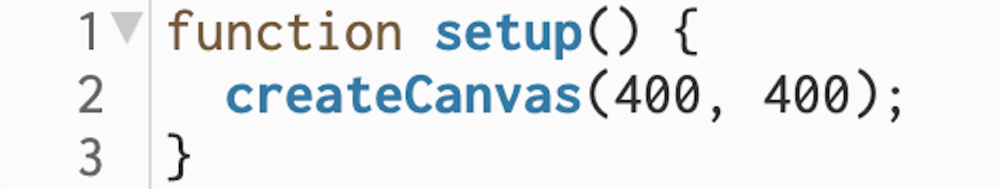
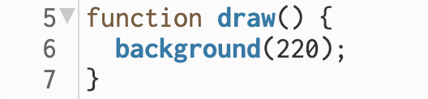
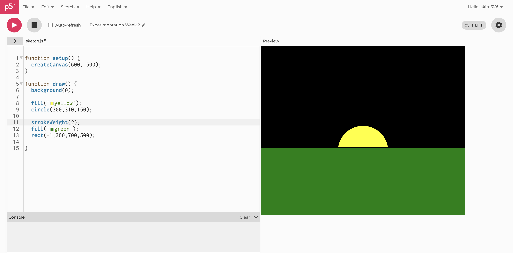
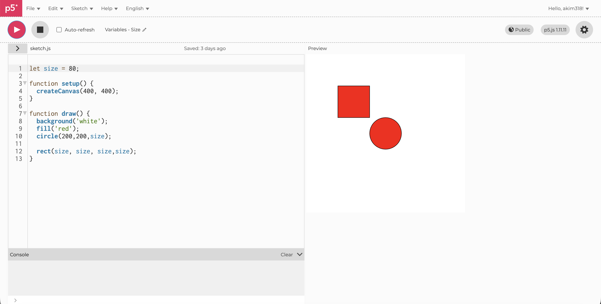
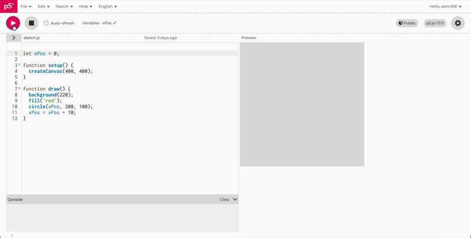
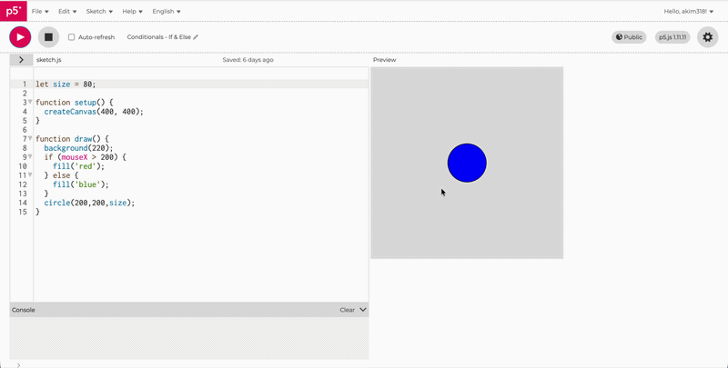
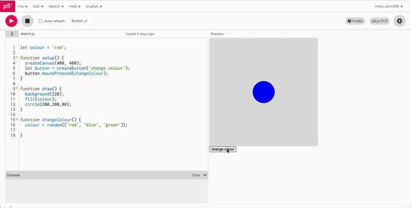
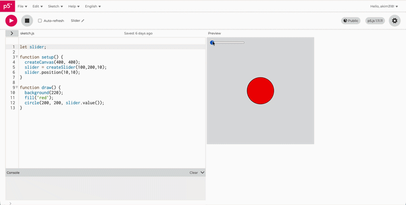
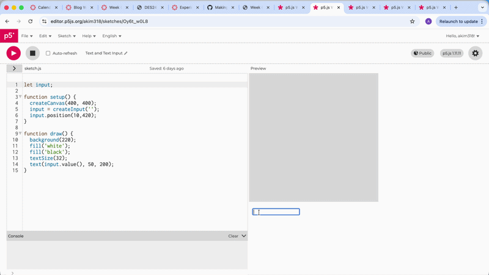

# Week 02

[← Back to Home](../index.md)

## Introduction
 Hello and welcome to Week Two of DES250: Designing with Data! This week we began our second in class experiment, focused on Interactivity. As a class, we explored p5.js, a creative coding program, to experience the fundamentals of programming and bridge the gap between physical materials and digital expression. Our experiments included sketching, working with DOM (Document Object Model) elements such as buttons, sliders, and text inputs, and trying out a new approach called 'vibe coding' a method that uses AI language models to assist in building programs.

## Building onto Last Week's Experiments
 Last week, we were introduced to Designing with Data through an experiment called the Independent Data Portrait. The class was split into groups of 4–5 and asked to collect personal data from one another to create hand-drawn data visualisation portraits. This week, before beginning our second experiment, we revisited that work by asking our teammates a few reflection questions about their own personal portraits: What did you track?, What did you notice?, What choices did you make about the visualisation?

## P5.JS
 We began by learning how p5.js works, starting with an overview of the interface before diving into its two core functions: the Setup function and the Draw function.
  
### The Setup function
 This function runs only once when the program starts. Within it, the create canvas  function defines the size of the canvas which is the space where your code will come to life.
 
 *Example Screenshot of Setup Function*
    
### The Draw function 
 This function runs continuously throughout the program, looping until the program is stopped. This is where most of the visual action happens.
 
 *Example Screenshot of Draw Function*
    
 P5.js also operates within a coordinate space, using x and y values to determine the position of elements. Notably, the origin point (0, 0) sits in the top-left corner of the canvas, rather than the bottom-left as you might expect from a traditional graph.

## My Experiments in Class
### Warm Up Experiment
 
 *Example Screenshot of Warm Up Experiment* 

### Size Variable
 
 *Example Screenshot of Experimenting with Size* 

### Position Variable
 
 *Example GIF of Experimenting with Position*

### Mouse X & Y
 
 *Example GIF of Experimenting with Mouse X & Y*
 
### Conditionals If & Else
 
 *Example GIF of Experimenting with Mouse X & Y*

### Button
 
 *Example GIF of Button*

### Slider
 
 *Example GIF of Slider*

### Text Input
 
 *Example GIF of Text Input*

## Vibe Coding
 Vibe Coding is an approach to building code where you describe what you want to an AI language model and then ask it to generate the code for you. We were encouraged to experiment with tools like ChatGPT, Claude, and Gemini to create more ambitious interactive sketches. Down below are some examples of my Vibe Coding projects using the language mode Claude.

### Bouncy Ball
 This sketch creates a bouncing ball that bounces around the edges of the canvas, changing direction each time it hits an wall. Every time the ball bounces, its colour randomises. This sketch uses conditional statements to detect when the ball reaches the boundary of the canvas and send it in the opposite direction. 

 <iframe src="https://editor.p5js.org/akim318/full/U11SoyUWX" height="500" width="600"></iframe>

 *P5.JS Embed of Vibe Coding Bouncy Ball Experiment*

### Fireworks
 This sketch builds directly on the mouse tracking exercise from class, but takes it further by combining several concepts together. The x and y coordinates of the mouse are used as the core data input, which are then paired with positional variables and conditional logic, if and when statements that determine how and where elements appear on the canvas based on where the mouse is. As you move the mouse around, the dots respond in real time.

 <iframe src="https://editor.p5js.org/akim318/full/_4ek6mL_s" height="500" width="600"></iframe>
  
  *P5.JS Embed of Vibe Coding Fireworks Experiment*

## Independent Study: Week 2
 Our independent study task this week was to use the P5.JS reference and tutorials to explore new techniques, and to translate the hand-drawn data portrait from Experiment 1 into an interactive P5.JS sketch. Because I had missed the previous class and didn't have data from that experiment, I focused instead on continuing to develop the projects we had started in class and refining them further.

### Making an Interactive Sketch
 Drawing on what I'd learned from the exercises we did in class, I created an interactive sketch using DOM elements to control what appeared on the canvas. The sketch works as a simple drawing app, as you move the mouse circles follow its path, acting as a pen. I built it up in stages. I started with the mouse x and y tracking code from class as the foundation, then added a clear button so the user could wipe the canvas and start fresh. From there I brought in the slider code we'd written previously and connected it to the circle drawing logic so it could control the size of the circles being drawn. Finally, I added a colour picker so the user could change the colour of the pen while drawing (the colours are randomised from red, green and blue). The main challenge was figuring out how to connect each DOM element to the right property on the canvas.

 <iframe src="https://editor.p5js.org/akim318/full/jYYyiikt0" height="500" width="600"></iframe>

 *P5.JS Embed of My Interactive Sketch*

## Reflection
 Because I missed the class where Experiment 1 took place, I didn't have data portrait to work with. Rather than skip the exercise entirely, I focused on building an interactive sketch that still engaged with the core ideas, using visual properties like size, colour, and position. It wasn't the intended starting point, but it meant I still worked through the same fundamental questions about how to translate data into something visual and interactive. I chose DOM elements that each controlled a distinct visual property. I used Claude to help build features that went beyond what we covered in class. I could describe what I wanted to control and work through the logic conversationally. If I had more time with this project, the first thing I would fix is the drawing mechanic. Currently the sketch generates circles continuously wherever the cursor is, rather than only when the mouse is held down, so not quite like a traditional drawing app. Missing the first class made this week harder, but working through the independent study tasks on my own still gave me a solid grounding. Going through the slides and talking to classmates helped me fill in the gaps. More broadly, this week made me more confident about choosing the digital approach for future projects, knowing that I have tools like Claude to help with the coding side means I don't have to default to physical just because it feels safer.

## AI Usage Statement

*Document any use of AI tools under an AI Usage Statement heading. Explain which tools you used and describe how you used them. Reference any AI-generated content (see [QuickCite](https://auckland.libguides.com/referencing-generative-ai-tools) for guidance).*

