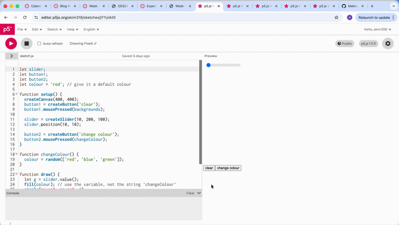
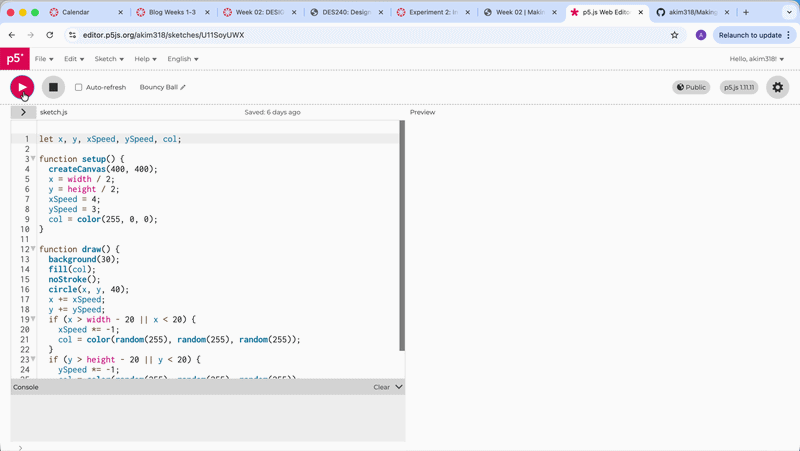
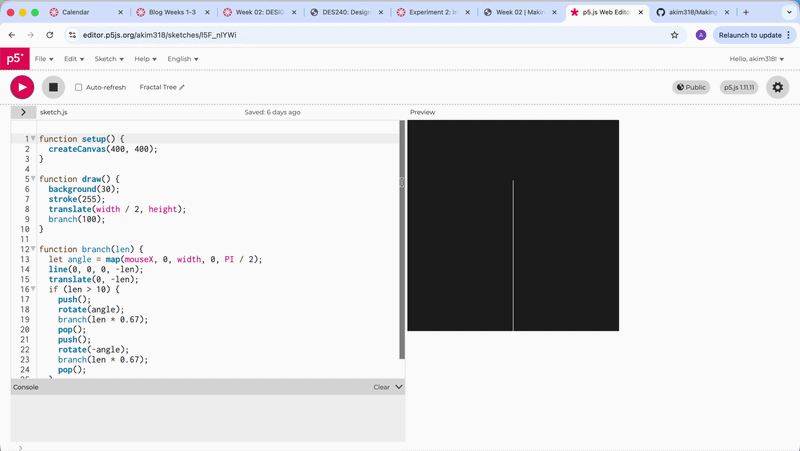
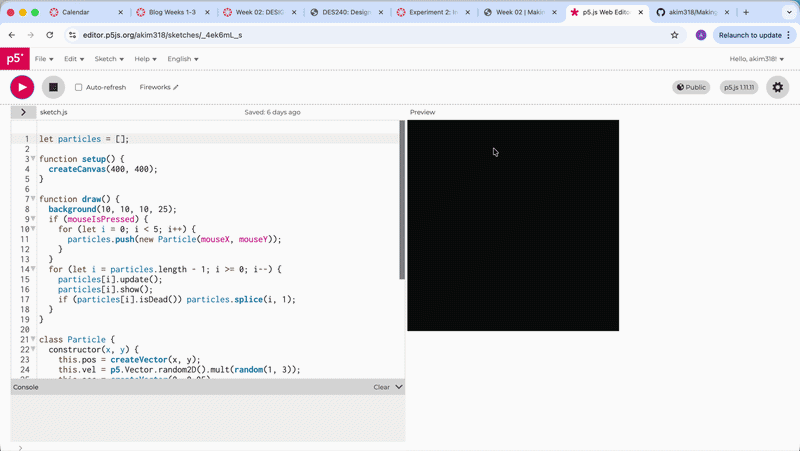
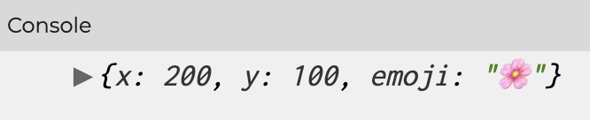

# Week 02

[← Back to Home](../index.md)

## Introduction
 Hello and welcome to Week Two of DES250: Designing with Data! This week we began our second in class experiment, focused on Interactivity. As a class, we explored p5.js, a creative coding program, to experience the fundamentals of programming and bridge the gap between physical materials and digital expression. Our experiments included sketching, working with DOM (Document Object Model) elements such as buttons, sliders, and text inputs, and trying out a new approach called 'vibe coding' a method that uses AI language models to assist in building programs.

## Building onto Last Week's Experiments
 Last week, we were introduced to Designing with Data through an experiment called the Independent Data Portrait. The class was split into groups of 4–5 and asked to collect personal data from one another to create hand-drawn data visualisation portraits. This week, before beginning our second experiment, we revisited that work by asking our teammates a few reflection questions about their own personal portraits:
    What did you track?
    What did you notice?
    What choices did you make about the visualisation?

## P5.JS
 We began by learning how p5.js works, starting with an overview of the interface before diving into its two core functions: the Setup function and the Draw function.
 
 We began by learning how p5.js works, starting with an overview of the interface before diving into its two core functions: the Setup function and the Draw function.
 
 ### The Setup function
 This function runs only once when the program starts. Within it, the create canvas  function defines the size of the canvas which is the space where your code will come to life.

*Example Screenshot of Setup Function*
    
### The Draw function 
 This function runs continuously throughout the program, looping until the program is stopped. This is where most of the visual action happens.

*Example Screenshot of Draw Function*
    
 P5.js also operates within a coordinate space, using x and y values to determine the position of elements. Notably, the origin point (0, 0) sits in the top-left corner of the canvas, rather than the bottom-left as you might expect from a traditional graph.

## My Experiments in Class

### Warm Up Experiment

*Example Screenshot of Warm Up Experiment* 

### Size Variable

*Example Screenshot of Experimenting with Size* 

### Position Variable

*Example GIF of Experimenting with Position*

### Mouse X & Y

*Example GIF of Experimenting with Mouse X & Y*
 
### Conditionals If & Else

*Example GIF of Experimenting with Mouse X & Y*

### Button

*Example GIF of Button*

### Slider

*Example GIF of Slider*

### Text Input

*Example GIF of Text Input*

### Making an Interactive Sketch
 Using what I had learned from the previous exercises, I created an interactive sketch using at least two DOM elements to control elements on the canvas. I began with a drawing sketch that included a button to clear the canvas and a slider to adjust the size of the circle but I also wanted to take it a step further by adding a colour picker to change the circle's colour.

*Example GIF of my Interactive Drawing Sketch*

## Vibe Coding
 Vibe Coding is an approach to building code where you describe what you want to an AI language model and then ask it to generate the code for you. We were encouraged to experiment with tools like ChatGPT, Claude, and Gemini to create more ambitious interactive sketches. Down below are some examples of my Vibe Coding projects using the language mode Claude.

### Bouncy Ball

*Example GIF of Bouncy Ball*

### Fractal Tree

*Example GIF of Fractal Tree*

### Fireworks

*Example GIF of Fireworks*

## Independent Study: Week 2
 Our task this week was to use the p5.js reference and tutorials to further our exploration into new techniques. I decided to follow the Data Structure Garden Tutorial by Portia Morrell, Jaleesa Trapp and Kate Maschmeyer. Tutorial description: In this tutorial, you will use p5.js to simulate an interactive flower garden. In this project, your digital canvas will come to life with 20 randomly generated flowers, each a different color and size. Users can also add diversity to the garden by clicking on the canvas to add new, unique flowers. Each flower is programmed with a wilting animation. This animation causes the flowers to slowly shrink and vanish, much like the natural cycle of a flower’s life.

### Step One: Make Your First Object
 We started by defining a flower by bundling the canvas coordinates with the emoji as well as adding in a command in the setup to print the flower in the console.
### Defining the Flower
<iframe src="https://editor.p5js.org/akim318/full/1tkdXJsPU" width="600" height="400"></iframe>

### Printing the Flower in the Console

*Example Screenshot of the Flower Printed in the Console*

## AI Usage Statement

*Document any use of AI tools under an AI Usage Statement heading. Explain which tools you used and describe how you used them. Reference any AI-generated content (see [QuickCite](https://auckland.libguides.com/referencing-generative-ai-tools) for guidance).*

