# Week 03

[← Back to Home](../index.md)

## Introduction
 Hello and welcome to Week Three of DES250: Designing with Data! This week we began our third in class experiment, focused on Live Data. As a class, we explored a little bit more with P5.JS, cURL, a powerful open source command line tool and library used to transfer data to or from a server and explored more into live data using weather data to help us visualise Our experiments including using our computers' Terminal to visualise our data by using the programs listed above.

## Building onto Last Week's Experiments
 Last week we were introduced to P5.JS and had time to explore it independently through our own data sketches. The goal was just to get a feel for what the tool is and what it's capable of, to show us that it's an option available to us to use for the larger data visualisation project. My individual sketch combined code from class with techniques I picked up through the P5.JS tutorials page and some vibe coding with Claude (an AI language model). The idea was a drawing app where you can draw on the canvas, clear it, change the pen colour, and adjust the stroke thickness. If I had more time, I'd refine the drawing mechanic. Currently the sketch generates circles continuously wherever the cursor is, rather than only when the mouse is held down, so it doesn't quite behave like a real drawing app.

## The Terminal
 The command line, also called the terminal, is a text based interface for communicating with your computer. Instead of clicking icons and buttons, you type instructions directly. You can use it to navigate files and folders, create and edit plain text files, run programs, and request data from the internet.

 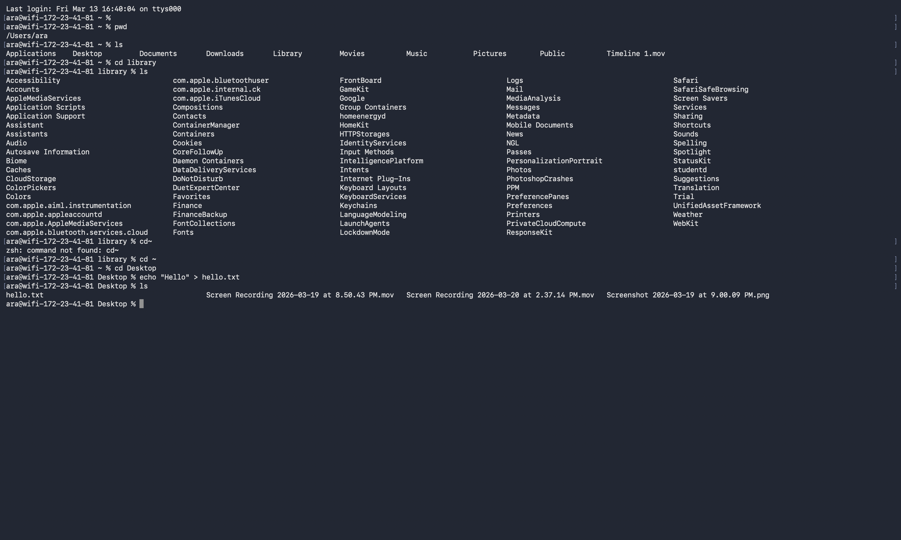
 *Screenshot of Navigating my Computer Through Terminal*

 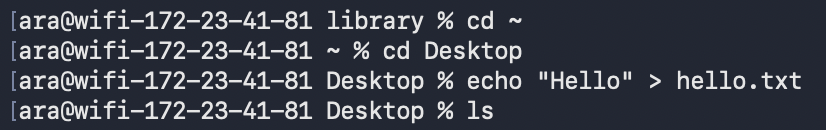
 *Screenshot of Creating a File and Writing Hello*

 
 *Screenshot of the Hello File on the Desktop*

 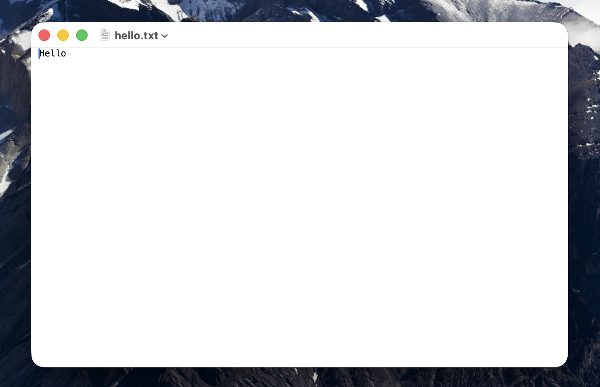
 *Screenshot of the Hello File Opened*

## uCURL
### Ascii Animations
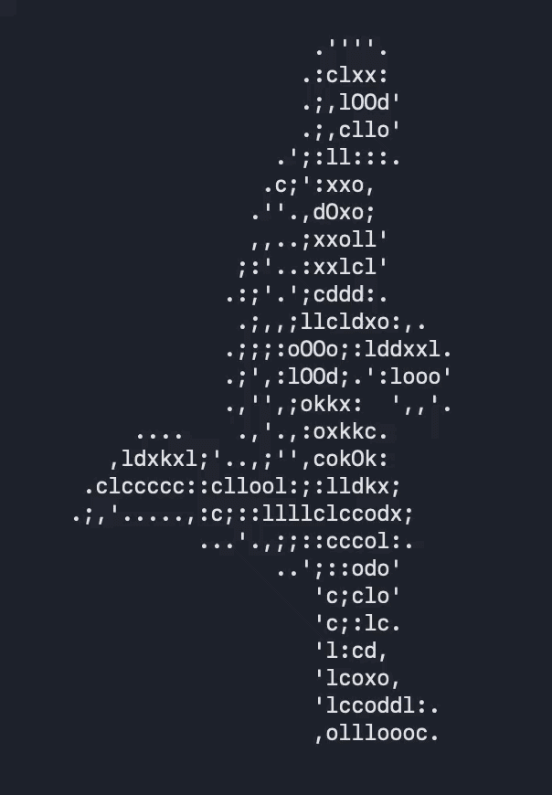
 *GIF of Forrest Running ASCII Animation*
  
 
 *GIF of Dancing Bird ASCII Animation*
 
 
 *GIF of World Turning ASCII Animation*
 
### Weather
 cURL retrieves live data from wttr.in, a weather forecast service that returns a fully formatted weather report as text directly in the terminal.
 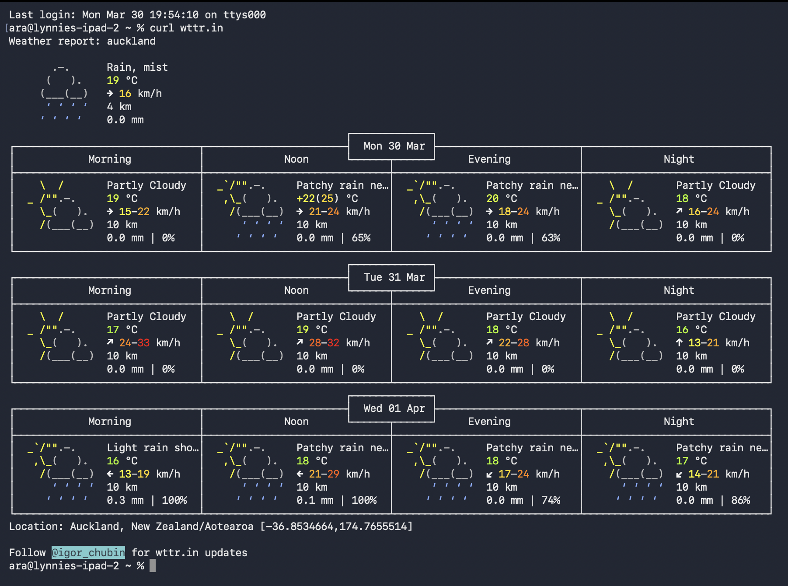
 *Screenshot of Weather In Auckland/My Location*

 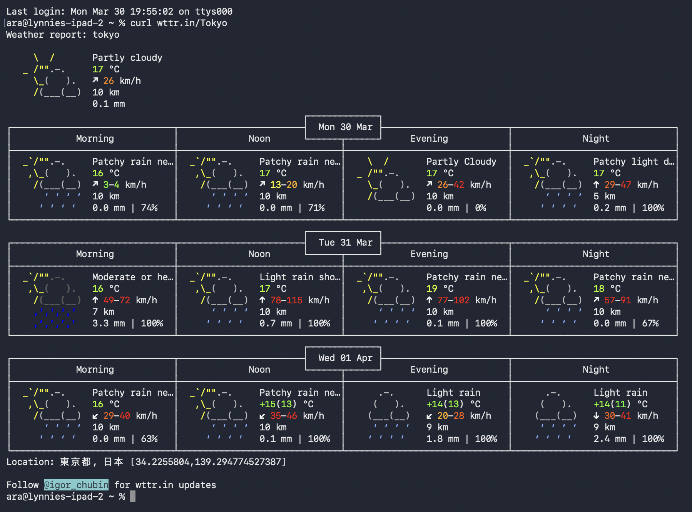
 *Screenshot of Weather In Tokyo*
 
 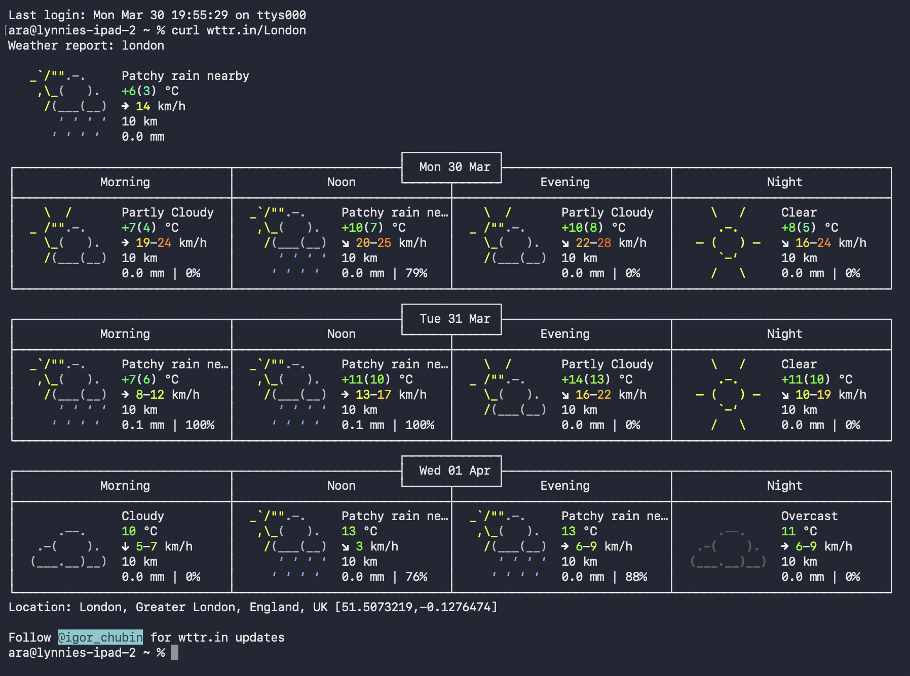
 *Screenshot of Weather In London*

 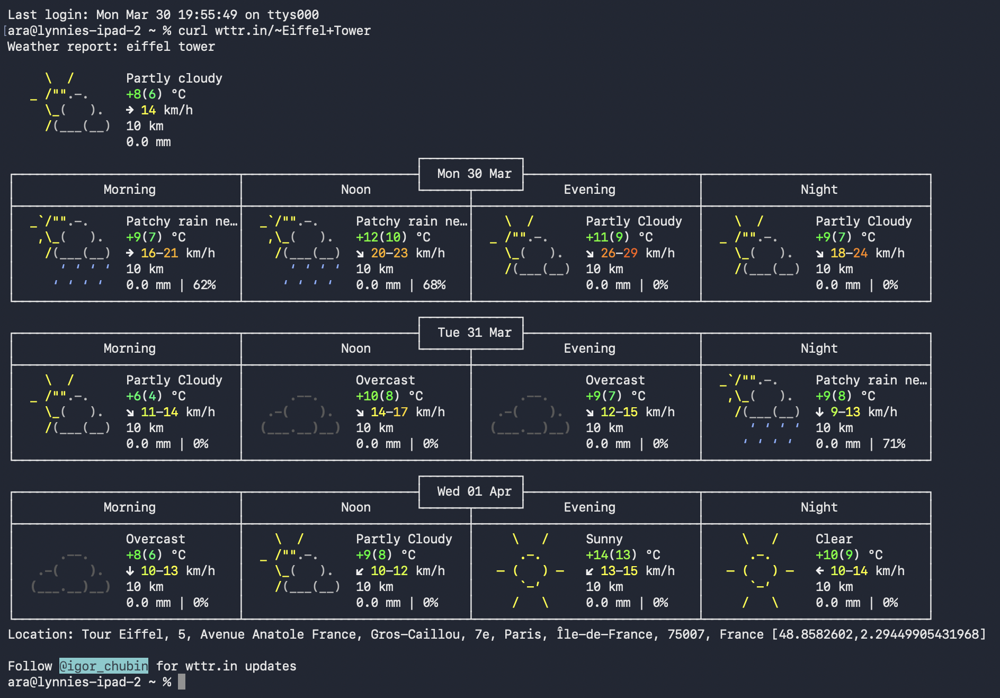
 *Screenshot of Weather at the Eiffel Tower*

### Filtering Live Data
 You can also add format parameters to your request to pull back only the specific information you want uing wttr.in.

### List of the Format Parameters:
 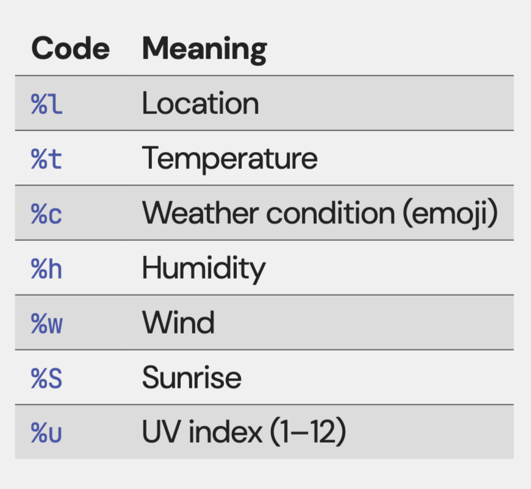
 *Screenshot of the List of the WTTR Format Parameters*

 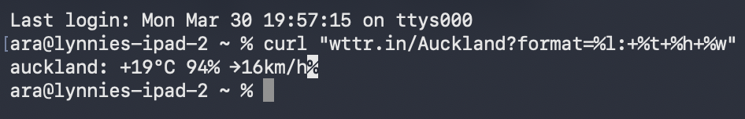
 *Screenshot of Weather Only Showing Temperature, Humidity and Wind*

 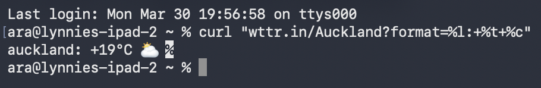
 *Screenshot of Weather Only Showing Location, Temperature and Weather Conditions using Emojis*

### Definitions
 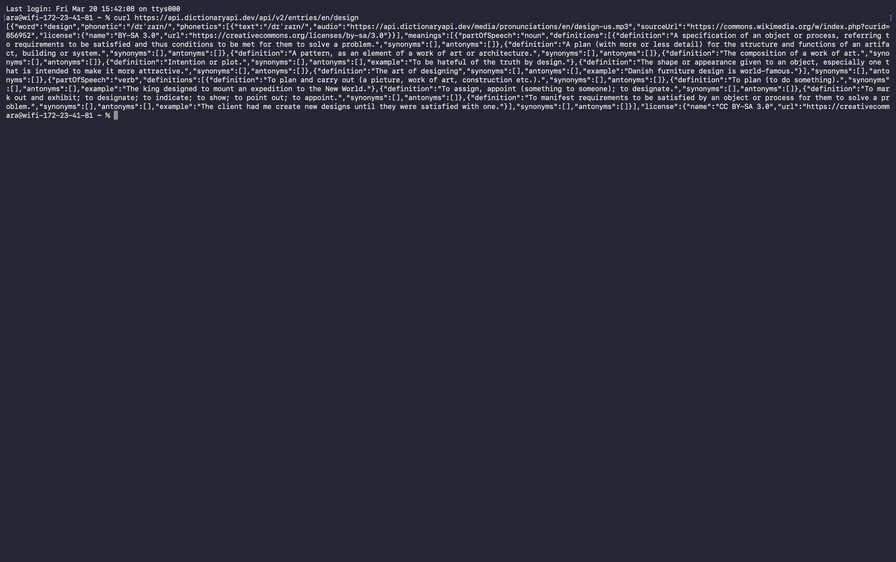
 *Screenshot of Dictionary Definition of Design*

## Weather visulisation
 The sketch shows live weather data to visual properties:
 Temperature: Size of the ellipse
 Wind Speed: Stroke weight of the line
 Humidity: Background colour
 
 <iframe src="https://editor.p5js.org/akim318/full/UQ8d66WPb" height="500" width="600"></iframe>

 *P5.JS Embed of Visualisation of Current Weather Data*

 The ISS tracker shows live location data of the International Space Station. Because the station is constantly moving, the coordinates change every time you reload.

 <iframe src="https://editor.p5js.org/akim318/full/EZ2P1C-LP" height="500" width="600"></iframe>
  
  *P5.JS Embed of International Space Station Live Data Tracker*

## Design and Execute a Data Protocol
### Our Protocol
 Source: Non lexical sounds heard in the room, words scuh as "um", "ah", "eh", etc.

 Frequency: Recorded in real time, as soon as each sound was heard (constant).

 Mapping: Repeated the non lexical sound heard out loud, then write down the sound exactly as you heard it.

 This made the data more specific and captured the variation between different types of non lexical sounds, you could see how often each particular one came up.

### The Protocol We Recieved
 Source: Record how many times you hear someone laughing in the room.

 Frequency: Every minute

 Mapping: Keep score by using a tally system to count how many laughs you hear.

 This was the data protocol we recieved, the problem we ran into with this protocol was that the instructions weren't clear on whether we should tally laughs as they happened throughout the minute, wait until the minute was up and then record the total or only record the laughs heard when as the mintue changed. We also weren't sure whether tallying in real time was effectively the same as just recording continuously, which would make the 'per minute' framing redundant. It was ambiguous enough that if the data protocol was given to a different group, they could tracking it differently from our group. We didn't get a chance to dicuss with the group who created this data protocol so we will never know how they intended us to interpret the rules as. 

## Independent Study: Live Data Visualisation - Puffins!
 <iframe src="https://editor.p5js.org/akim318/full/7FFbg2rLC" height="500" width="600"></iframe>

 *P5.JS Insert Of My Live Data Visualisation using Live Alantic Puffin Data From Researcher Aevar Petersen, Tracking Thirteen Different Puffins Across A Span Of Multiple Years And Current.*

 I chose a digital approach because it made integrating my dataset much easier and allowed me to produce a more detailed final product. Working digitally also meant I could edit and adjust the visualisation freely as I went, which wouldn't have been as straightforward with a physical approach and I didn't want to go out and buy materials.

 For the data, I used Movebank, an animal tracking website that hosts a wide range of datasets covering different species. I wanted to work with animals because it's a topic I am interested in, and I knew free tracking data would be available. I chose puffins specifically because I think they are very cute.

 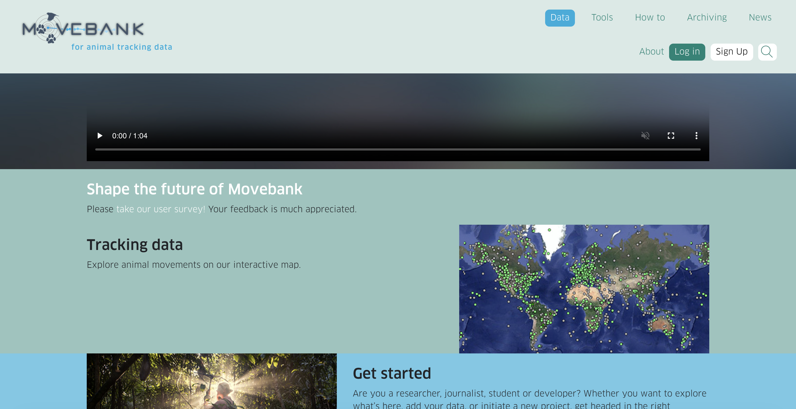
 *Screenshot of Movebank*

 The dataset I used was called "Atlantic Puffins in Iceland" collected by Aevar Petersen, and it tracked 13 individual puffins. I gave each puffin a distinct colour and an Icelandic name to make them easier to tell apart. Rather than plotting the movement data on a blank canvas, I set the background as a world map so viewers could understand the geographic context of what they were seeing.

 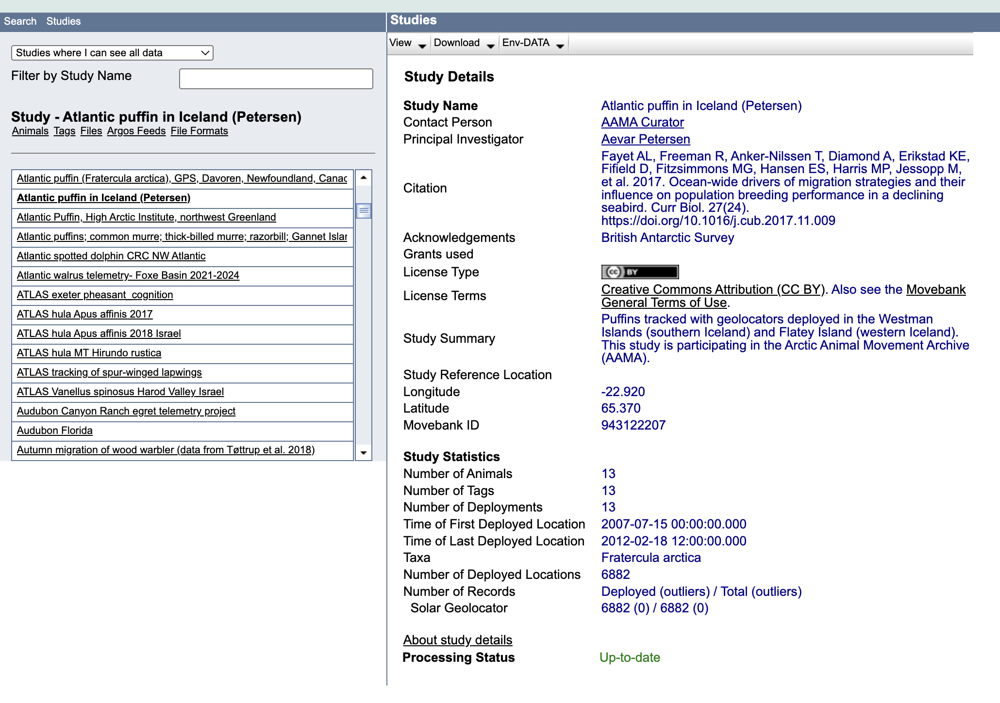
 *Screenshot of Puffin Data*

 One challenge with Movebank is that it hosts data in CSV format, not JSON, which is what P5.JS requires to pull data from an external source. To get around this, I downloaded the CSV, converted it using an online tool, uploaded the JSON file to a new GitHub repository, and linked P5.JS to that, which solved the access problem.
 
 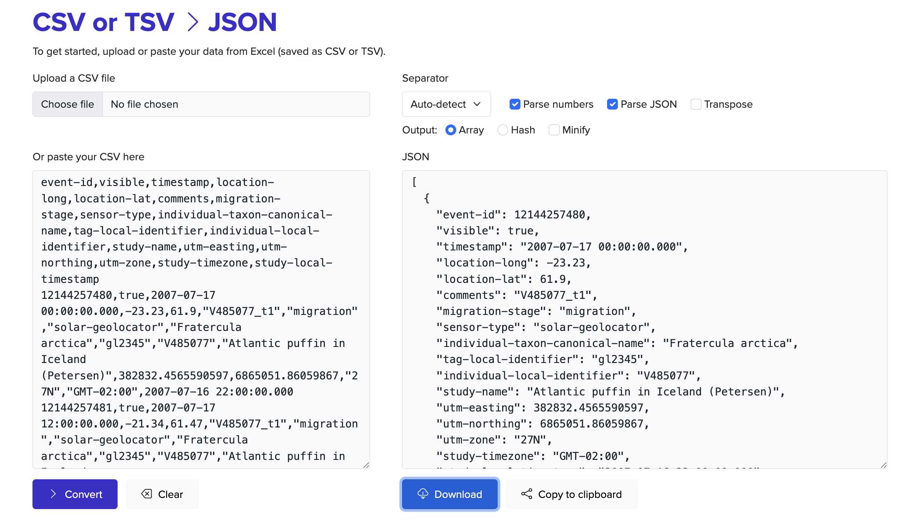
 *Screenshot of CVS to JSON Convertor*

 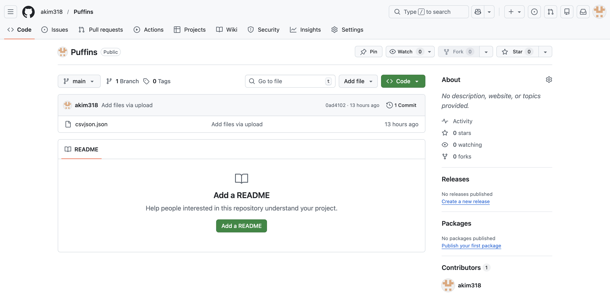
 *Screenshot of Puffin Data in New Github*

 With the help of Claude (an AI language model) for the coding, I built a timelapse visualisation that animates the puffins' movements over the years the data was collected. The map background gives real geographic context, which makes it much easier to follow where the puffins are going. The main limitation I ran into was that as the trail lines each puffin leaves behind start overlapping, it becomes hard to distinguish individual paths.

 If I were to develop it further, I'd slow the movement down and either shorten how long the trails stays on the canvas or remove them altogether, so the focus stays on where each puffin actually is rather than where it's been. One thing worth noting is that the Movebank data is continuously updated, so while you won't see changes as rapid as something like the International Space Station tracker, it's still a live dataset.

 I chose to make this data visulisation digitally as I has help from AI and new different tools introduced in class. Normally in a situation like this, I would pick the physical option because I find coding difficult and time consuming even with prior experience. But having Claude to help with the P5.JS side gave me the confidence to take the digital route and actually work through problems I would have otherwise avoided.

## AI Usage Statement
 Anthropic. (2026). Claude (Sonnet 4.6) [AI Language Model]. Claude.AI. https://claude.ai/login
