# Week 06

[← Back to Home](../index.md)

## Documentation 

# Introduction
 Hello and welcome to Week Six of DES250: Designing with Data! This week marked the shift from broad experimentation into a focused project direction. Following our individual Proposal Consultations, each of us committed to a direction for the Data Driven Visualisation project and began working directly with real datasets for the first time. The week involved exploring data sources, developing visual references, sketching out what the final artefact might look like, and producing a first working prototype.
 
##  Data Exploration
### What the data source is, Where it comes from, What the data contains and How it is structured
 This project draws on two primary data sources: Movebank, an open animal tracking repository, and ICES (International Council for the Exploration of the Sea), an ocean monitoring organisation that compiles marine research across member countries. The first dataset I have chosen is whale shark movement data from the Gulf of Mexico, compiled by researcher Eric Hoffmayer and accessed via Movebank. It contains GPS tracking coordinates for 41 individual whale sharks over a multi year period, recording where each animal was first tagged, their movements across time, the organisations involved in tagging, and positional data in latitude and longitude. For this project the dataset contained 3,424 GPS observations, which I later sampled down to 448 points for performance in p5.js. This dataset is the primary driver of the visual as each data point becomes a circle on the canvas, positioned where that shark physically was, pulsing at a rate driven by its movement speed.
 
 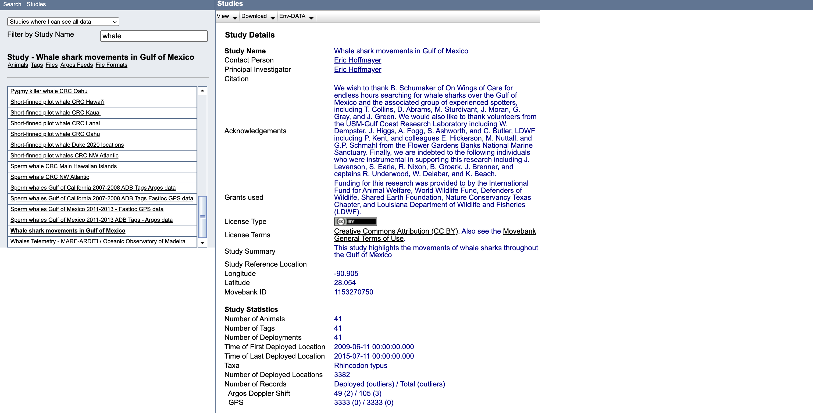
 *Screenshot of Whaleshark Data Description from Movebank*

 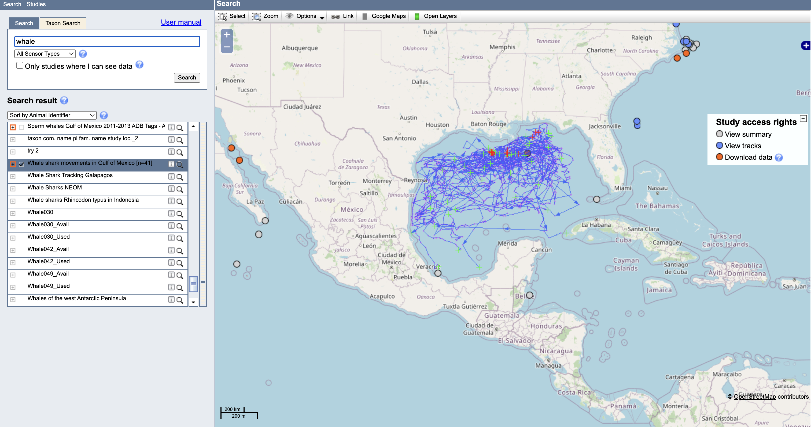
 *Screenshot of Map Showing Where on the Map the Data was Collected From*

 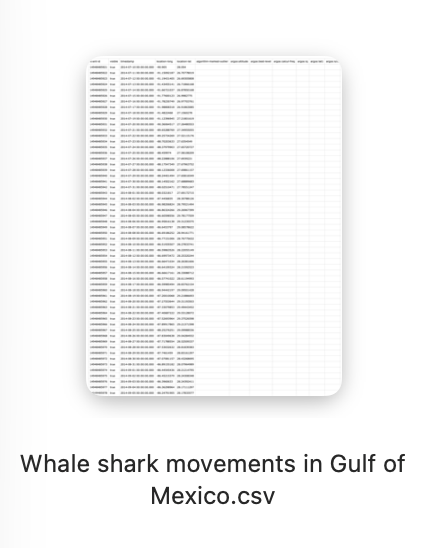
 *Screenshot of CSV Sheet of Whaleshark Data*

 The second data set I have chosen is ICES oceanographic data, specifically biological community records covering zooplankton and phytoplankton populations, and sea temperature measurements from the Northern Norwegian Sea (Sørkapp Section, Atlantic Water layer), compiled by the Institute of Marine Research Norway. This dataset spans from the 1980s to the present day (2026), providing a long term record of ocean conditions. Its structure includes fields such as sample ID, country, latitude, longitude, depth range, date, season, species identifier, species name, and AphiaID. This environmental data will provide the second visual layer of my data portrait; ocean temperature and biological activity inflecting colour and saturation over time.

 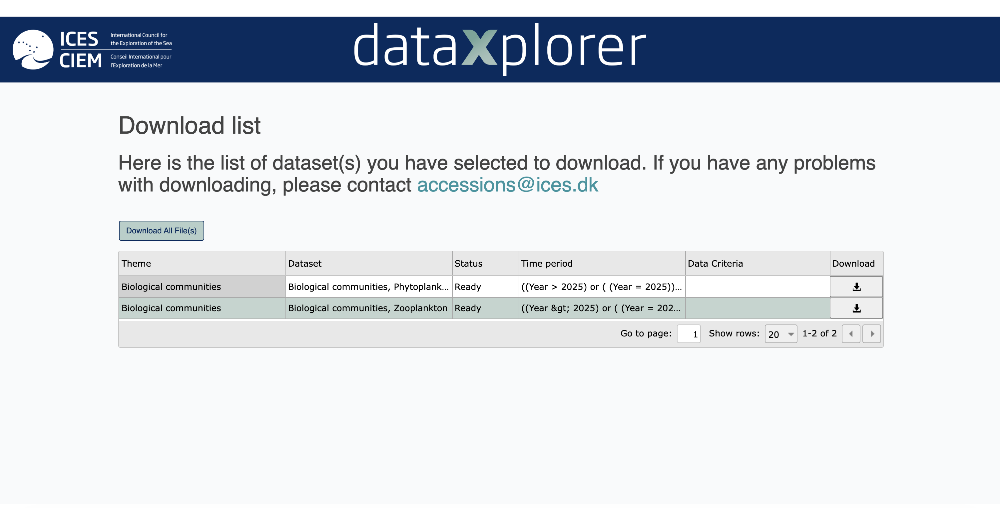
 *Screenshot of Ready to Download Datasets from ICES*

 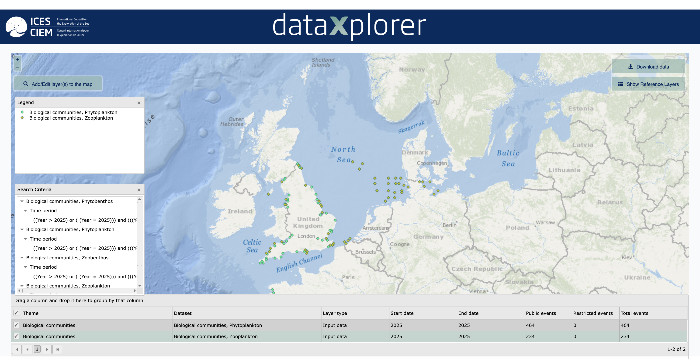
 *Screenshot of Map Showing Where on the Map the Data was Collected From*

  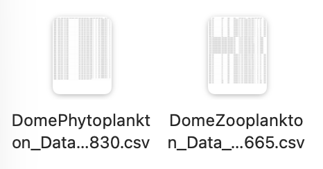
 *Screenshot of CSV Sheet of Microorganism Data*

### Any limitations, biases, or gaps that you notice (or anticipate, if the data is to be collected or simulated); and what these mean for your project direction
### Geographical Fragmentation
 The most significant limitation is geographical. Ideally, this project would draw on data covering the entire ocean at a single point in time to show a complete, simultaneous portrait of the whole system, however, no such dataset exists. Data is collected by specific research teams, in specific locations, over specific periods, funded by specific institutions with specific priorities. The whale shark data is from the Gulf of Mexico while the microorganism records are from the Northern Norwegian Sea. These are two very different parts of the world, and combining them into a single visual means the work is not a precise scientific record of one place. I have thought carefully about whether this is a problem and my conclusion is that it might actually be a strength. The ocean is one connected system, the Gulf of Mexico and the Norwegian Sea are part of the same body of water, subject to the same pressures, responding to the same climate forces. Bringing data from both into the same visual space might communicate something true about the scale and interconnectedness of ocean ecosystems that a single location could never capture.

## Visual Research and Precedent Study
### Claude Monet - Water Lilies Series (1896-1926)
 A central design challenge for this project has been finding a way to represent the ocean without relying on obvious ocean imagery (no waves, no fish, no boats). That kind of literal iconography would undermine what the project is trying to do. If the data is the most honest version of the ocean, I believe the visual language needs to come from the data itself, not from a pre existing idea of what the ocean is supposed to look like. The direction I landed on is abstract and watercolour based artistic style with colour fields that bleed into each other, circles that grow and shrink like breathing, movement that drifts rather than rushes. The goal is that a viewer recognises the ocean not because they see a wave, but because they feel the quality of water by its weight, its slowness, its depth and the way light moves through it. The biggest influence on this has been Claude Monet. In the final decades of his life, Monet embarked on a series of monumental compositions depicting the lily ponds in his gardens at Giverny in northwestern France. He envisioned a circular installation of vast paintings that would envelop the viewer in an expanse of water, flora, and sky. His paintings have no horizon line, no fixed perspective and no literal reference point but from first glance, the viewer knows exactly what they are looking at; a peaceful body of water. This is exactly the relationship I want my work to create between a viewer and the ocean, immersion into the data.

 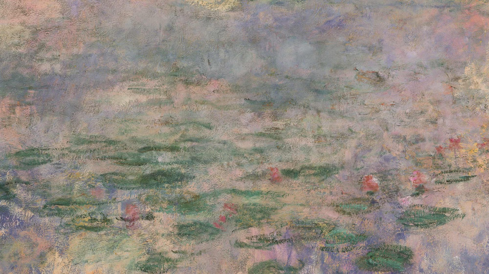
 *MOMA - Claude Monet. Water Lilies. 1914-26. Oil on canvas*

  
 *MOMA - Claude Monet. Water Lilies. 1914-26. Oil on canvas*

### Bow Seat — Sea Life Hears More Than You
 Bow Seat is an organisation that runs an annual Ocean Awareness Contest, inviting young people worldwide to make art, poetry, film, and multimedia work exploring how human activity impacts the ocean. One of the works that caught my attention was Sealife Hears More Than You by Chenyue Zhuang, a 2025 entry from Beijing. It is an immersive multimedia installation that places viewers inside the underwater world to experience sound pollution from a marine animal's perspective. Visitors enter a completely darkened space surrounded by four projection screens creating a 360 degree visual environment. The experience begins with peaceful ocean visuals and whale songs, then gradually introduces the overwhelming industrial sounds that plague our oceans; ship engines, drilling and sonar sounds. As Zhuang describes it, the goal is to transform abstract environmental data into immediate physical experience, creating an empathetic bridge between human perception and marine animal experience. What draws me to this is the idea of making a hidden dimension of ocean life perceptible. Sound is data too, it is just data most of us cannot access without some kind of intervention or translation. Zhuang is doing with acoustics what I am trying to do with GPS coordinates and other oceanographic records: taking information that exists but is invisible to ordinary people and rendering it in a form they can actually feel. This reference reinforced the idea that the most powerful ocean art is not the work that shows you the ocean but it is the work that helps you sense something about it you could not sense before.

 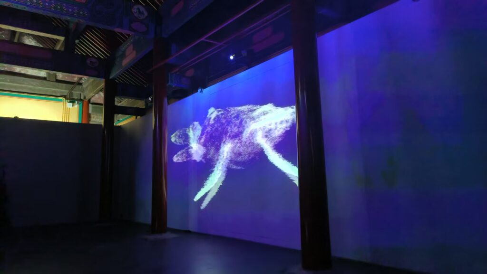
 *Sea Life Hears More Than You by Chenyue Zhuang. Beijing, China. 2025*

 <iframe width="560" height="315" src="https://www.youtube.com/embed/CMsysqDyqLU?si=KWuupZn0-NMr1jdI" title="YouTube video player" frameborder="0" allow="accelerometer; autoplay; clipboard-write; encrypted-media; gyroscope; picture-in-picture; web-share" referrerpolicy="strict-origin-when-cross-origin" allowfullscreen></iframe>
 
### Club Ocean — Animal Tracking Bracelets and Adoption Plushies
 Club Ocean sells bracelets and adoption plushies that each come with a secret access link letting you track a real named animal's movements in the ocean. What draws me to this is what it reveals about how people form emotional connections with data. Club Ocean has found a way to make animal tracking feel personal and intimate, you are not looking at a dataset, instead you are following your animal, checking where it went and caring about it. The specific quality I want to carry forward is that sense of personal relationship with an animal you will never interact with. My project is working with the same underlying data but rendering it as ambient art rather than a consumer product. The question this raises for my work is: how do I create that same feeling of connection without the explicit personalisation? 

 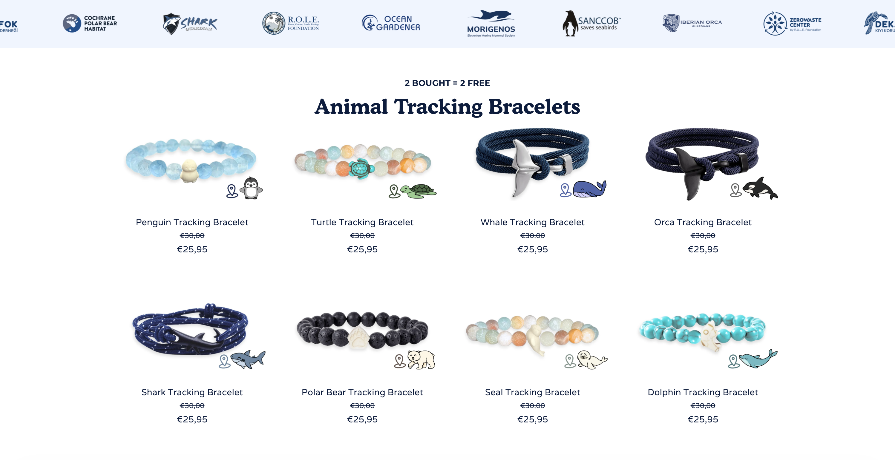
 *Screenshot of Bracelets for Sale on Club Ocean Website*

 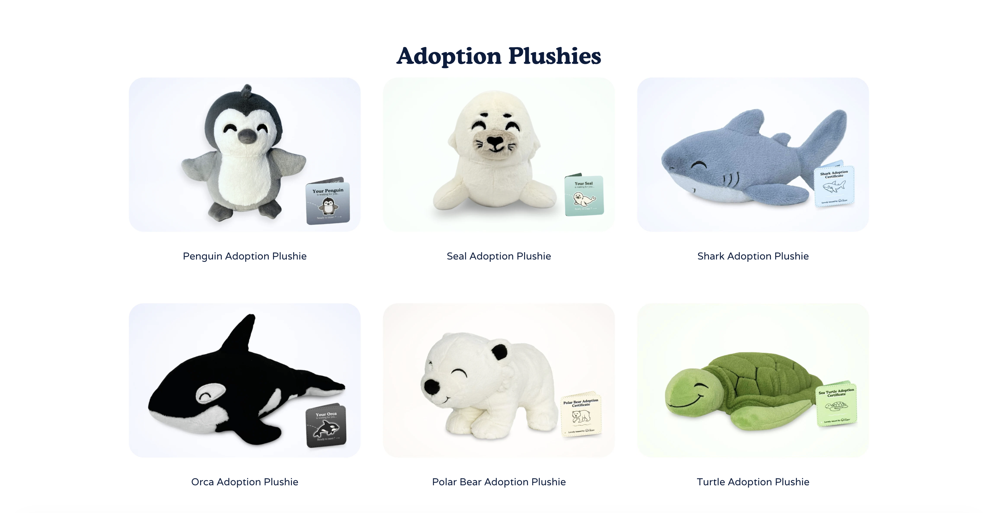
 *Screenshot of Plushies for Sale on Club Ocean Website*

### Gustav Klimt - Attersee (1900)
 Gustav Klimt's early 1900s painting Attersee serves as a key visual reference for my data portrait, being a key visual reference on how I envision and plan to present my datasets visually. His series of paintings depicting the Attersee lake in Upper Austria are characterised by a distinctive blue and green palette, yet it is his handling of brushwork and composition that makes them intriguing to the viewer without being confusing. The balance between his recognisable abstract style and an underlying sense of depth keeps the viewer engaged, which is a quality I hope to also show in my own work.

 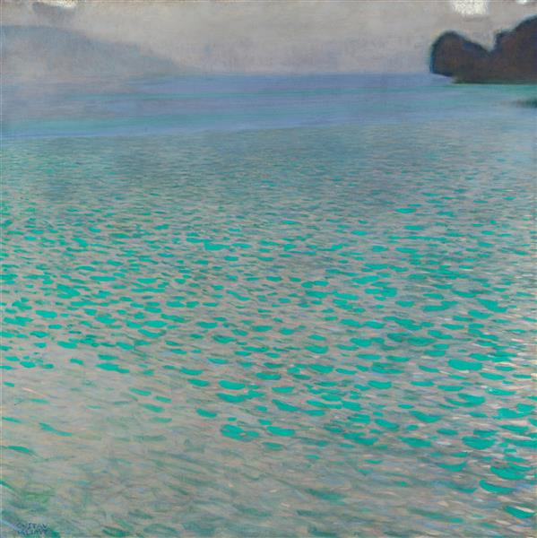
 *Gustav Klimt. Attersee. 1900 - 1902. Oil on canvas*

### 100 for the Ocean — Photography Print Fundraiser
 100 for the Ocean is a print fundraiser organised by photographers Paul Nicklen, Cristina Mittermeier, and Chase Teron, bringing together 100 world class photographers whose work is sold with 100% of net proceeds going to ocean conservation. Mittermeier has described the goal as not just raising funds but starting a conversation, sharing the stories of the planet, creating connection, and making a lasting impact. What draws me to this is the model it proposes: art as the mechanism for creating connection between people and the ocean, with that connection then translating into real conservation outcomes. This fundraiser strengthened my confidence in the direction I have chosen for my data portrait, as it demonstrates that art and visually compelling work can be an effective strategy for communicating ocean conservation messages.

 
 *100 for the Ocean. 2026 Print Sale. Photographer Steve McCurry. Vietnam*

 
 *100 for the Ocean. 2026 Print Sale. Photographer Steve McCurry. Iceland*

## Project Planning and Skills Roadmap
### What do I need to make?
 The final artefact will be a slowly shifting, screen based colour visualisation, a living painting driven by real ocean data. Animal movement and environmental conditions will translate  directly into colour, saturation, and form, with everything in a state of continuous, gentle motion. The visual style is rooted in watercolour and abstraction, drawing on artists like Gustav Klimt and Claude Monet as reference points. The goal is not to present the data in a conventional sense, but to translate it into something more digestible and more felt, something that stays with you and draws you back and build a connection to non human ocean life that might, hopefully, inspire a greater care for ocean conservation.

### What do I need to learn?
 1. P5.JS Coding Skills: The primary technical skill I need to develop is using p5.js. As I mentioned in my proposal consultation, I do have prior coding experience, but not with this library specifically. That said, I feel more confident approaching this digitally than I would have earlier in the course as experimenting with different AI language models and vibe coding over the past few weeks have helped me realise how much AI language models can bridge the gap between having an idea and being able to build it. My plan is to work through p5.js with the help of Claude, pushing it as far as I can and learning through the process of making.

 2. Physical Output: I need to solidify how I want to present the work at the showcase. The project is screen based, but the physical form that screen takes is still something I have not fully settled on. Do I mount it in a frame on the wall like a painting? Use a projector in a darkened room? Build it into some kind of sculptural form? Each option creates a very different experience for the viewer and sits differently with the concept, so this is a decision I need to make deliberately rather than by default. Once the format is confirmed, I will also need to brush up on my soldering skills to handle whatever physical construction the display requires.

 3. Consistency: One challenge I anticipate is staying on top of both the project work and the journal entries across the rest of the semester. Without formal deadlines between the consultation and the final submission, accountability is largely self managed, which means building my own structure and check ins to make sure neither the making nor the documentation falls behind.

### What are my next steps?
 The first step is sourcing the data I want to work with through Movebank and ICES, then using Claude to help draft an initial version of the sketch. Rather than planning everything out in advance, I learn best by jumping in and experimenting, so that is the approach I am taking. I also want to focus on getting the visual aesthetic right before locking in how the data maps to it. Developing the colour, movement, shapes, and gradients first, without the data attached, will give me more freedom to experiment and find the right visual language before committing to a single direction.

## Independent Study 
### Consultation Reflection
 The feedback I recieved from the proposal consultation was reassuring. Leo commented that using a painterly approach to data visualisation as a way of building connections to non human life was compelling and original, and that the conceptual thinking behind the proposal came through clearly, which gave me much more confidence in the direction I am taking the project. I was pushed to explain concepts I had mentioned in my proposal but had not fully settled on, as well as connections I had not considered before. The consultation helped me clarify a lot of the more artistic, non data thinking that sits at the core of the project. Overall, it left me feeling more confident in my direction, and gave me the freedom to think more conceptually about the data itself; how I present it, and how my work will build toward a more well rounded data portrait.

### Technical Skill Building & Initial Concept Sketch
 I began the technical side of this project by separating two problems that I think are easy to conflate: getting the visual to look right and getting the data to work. Rather than attempting both at once, I started by focusing entirely on the aesthetic, using Claude to help me generate p5.js code that captured the watercolour quality I was after before attaching any real data to it. The reasoning was that if I jumped straight into mapping datasets, I would end up making visual decisions under the pressure of the data's constraints, which could push the work toward something more functional and less considered than I wanted. Starting with the aesthetic gave me the freedom to experiment with colour, movement, blending, 
 and form on their own terms first. My first prompt to Claude was: "write the code for a p5.js project so that colours move and blend into each other like watercolour, artistic style.". I wanted to see what the model would interpret from a loose creative brief rather than a technical specification because I was curious whether the output would give me something unexpected.

  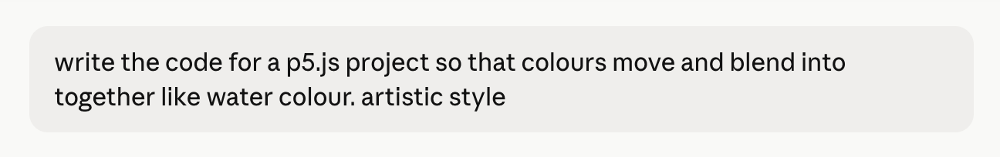
 *Screenshot of my Prompt in Claude*

### What Claude Generated:
 <iframe src="https://editor.p5js.org/akim318/full/cTABIT9Cs" width="560" height="315"></iframe>

## References:
 References100 for the Ocean | Print Fundraiser for Ocean Conservation. (2024). 100 for the Ocean. https://www.100fortheocean.com/ClubOcean | Bracelets & Plushes that helps Marine Animals. (2025). ClubOcean. https://clubocean.store/?tw_source=google&tw_adid=700530092804&tw_campaign=21314473092&tw_kwdid=kwd-630202960952&gad_source=1&gad_campaignid=21314473092&gbraid=0AAAAABIU6hWKUJaqNSyGY80k6qCxdhaoX&gclid=Cj0KCQjwzqXQBhD2ARIsAKrIeU8tiKCfXW-hcFbWjyorWdQqoAYnKaU6uRNwOT1jhAZ6ac9hAgeF7KcaAtGaEALw_wcB
 
 Gustav Klimt | Highlights | COLLECTION | Leopold Museum. (2025). Leopoldmuseum.org. https://www.leopoldmuseum.org/en/collection/highlights/145
 
 McCurry, S. (2024, June 3). Steve McCurry. Steve McCurry. https://www.stevemccurry.com/news/100-for-the-ocean-print-sale
 
 MoMA. (2024). MoMA. MoMA; MoMA. https://www.moma.org/
 
 Movebank. (n.d.). Www.movebank.org. https://www.movebank.org/cms/movebank-main
 
 Sea. (2025, November 16). Sea Life Hears More Than You • Bow Seat Creative Action for Conservation. Bow Seat Creative Action for Conservation • Activating the next Wave of Ocean Leaders through the Arts, Science, and Advocacy. https://bowseat.org/gallery/sea-life-hears-more-than-you/ 
 
 Welcome to ICES. (n.d.). Www.ices.dk. https://www.ices.dk/Pages/default.aspx

## AI Usage Statement
 Anthropic. (2026). Claude (Sonnet 4.6) [AI Language Model]. Claude.AI. https://claude.ai/login