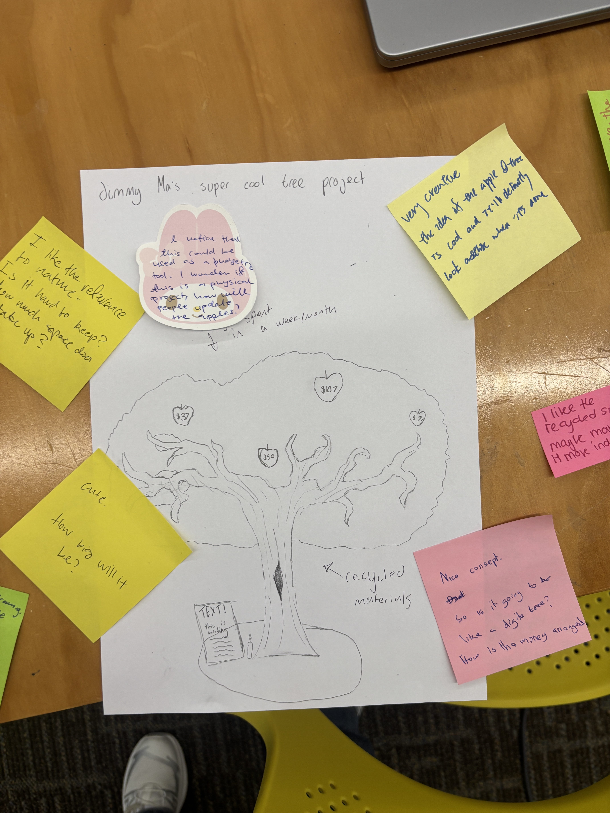
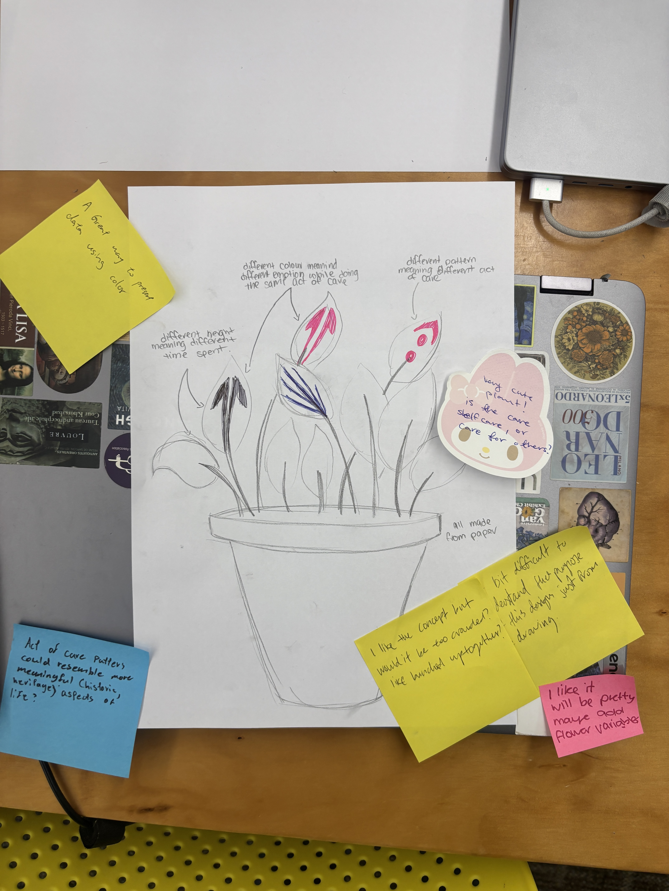
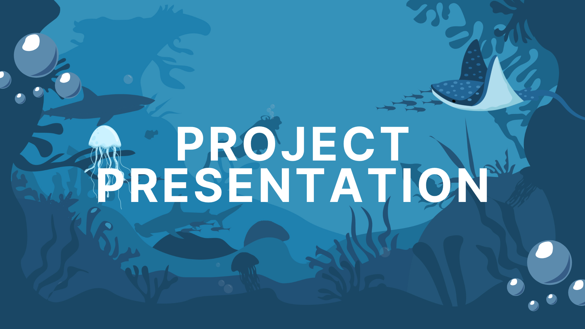
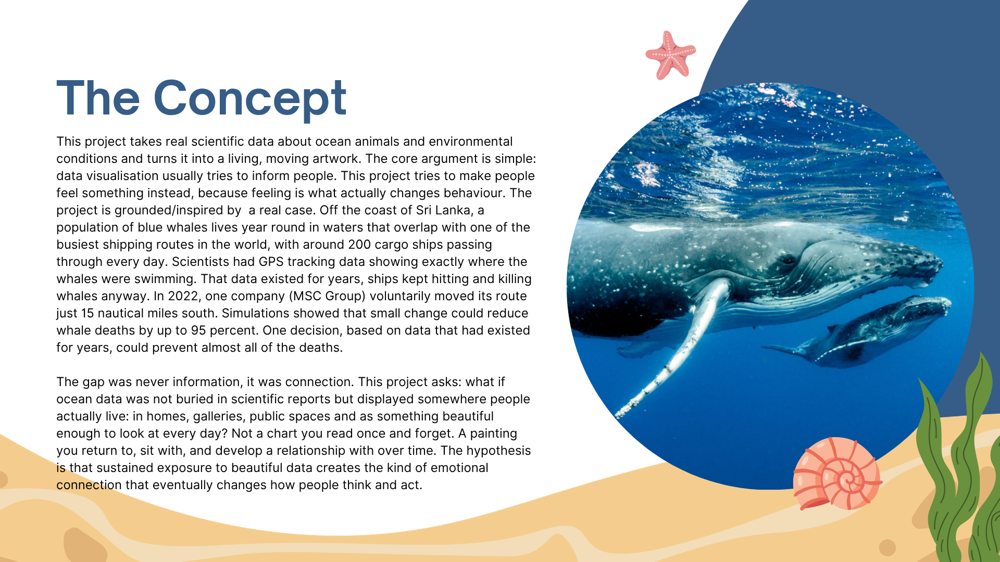
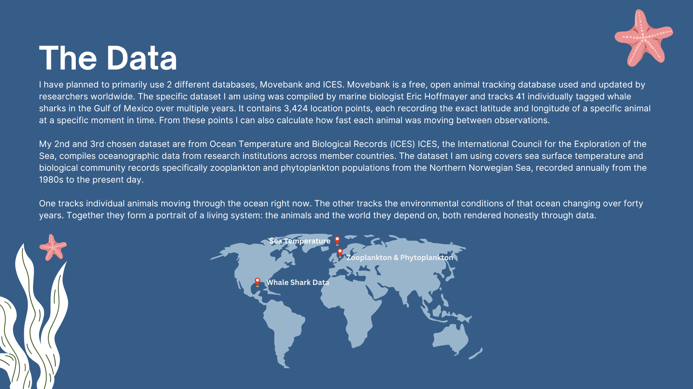
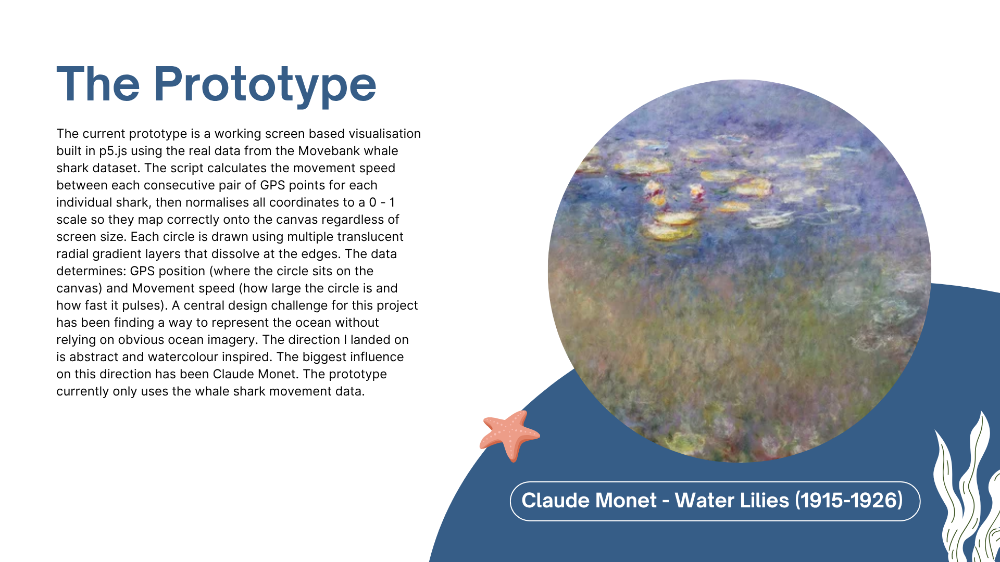
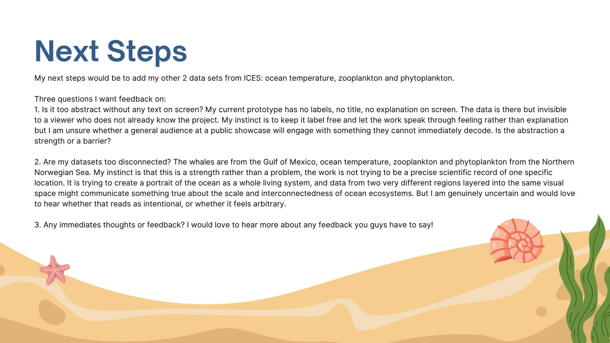
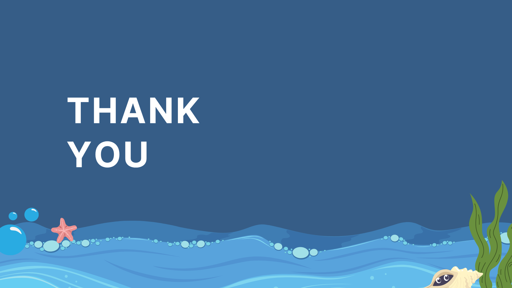

# Week 07

[← Back to Home](../index.md)

## Documentation 
# Introduction
 Hello and welcome to Week Seven of DES250: Designing with Data! This week was all about hands on interation. We developed our concept sketches further through another round of peer feedback, spent time ideating in a making sprint, and then explored alternative directions for the project through what if variations with a partner.

## Concept Sketches 
### My Sketch
 
 *Photo of my Sketch & Comments Received*

### Comments I Received
 1. "Looks colourful. But don't know what it is and what it shows."
 2. "Looks interesting. What are you trying to show? Data wise?"
 3. "Absraction! data-moving. What is the data?"

### Next Steps + Revisions
 One main issue I can see in my work is that people cannot tell what the data is. This gave me something I needed to address: being more specific about what the viewer is actually looking at without making the work too literal or turning it into a chart. What the feedback did do was push my thinking in a new direction. Instead of leaning further into an artsy or painterly style, I started thinking about how I could make the work feel more connected to the ocean itself through movement, colour, and atmosphere. I want to move away from visuals that feel too much like just a painting and instead focus more on flowing wave like forms, layered motion, and different shades of blue that immediately resemble the ocean. I think using more gradient blending, fluid movements, and colours inspired by water could make the work feel more recognisable and immersive. One thing I was happy about from the feedback was that everyone said the work looked visually interesting. That matters to me because one of the core goals of this project is creating something that catches attention and stays in people’s minds long enough for them to engage with it more deeply. Moving forward, I want to explore this more ocean inspired visual language and see if making the work feel more fluid and blue will help the viewers connect with the data more naturally.

### Comments I Left
 I also left feedback on four other sketches during the circulation activity:

 
 *Photo of Sketch & My Comment: "I notice you want to translate things (emotions) into a physical piece. I wonder are those 2 different project?"*
 
  
 *Photo of Sketch & My Comment: "I notice that this could be used as a budgeting tool. I wonder if this is a physical project, how will people update the apples?"*

 
 *Photo of Sketch & My Comment: "Very cute plant! Is the care selfcare, or care for others?"*

  
 *Photo of Sketch & My Comment: "Cool Sketch! How will you collect the data? Will it be translated in real time?"*

 Leaving feedback on other people's work was useful because it made me think about questions I had not thought to ask about my own project. The question about real time data in particular made me think more carefully about how live the data in my own piece actually is, and whether that needs to be more visible to a viewer.

## Making Sprint
  During the making sprint, I focused on converting my sketch into an actual working p5.js piece and connecting my datasets to it for the first time. Rather than tackling everything at once, I decided to add each dataset one by one as I have a lot of data and didn't want to overwhelm the programme before I even understood how it was behaving. The first dataset I brought in was the whale shark movement data from the Gulf of Mexico, sourced from Movebank. My previous sketch wasn't hitting the visual style I had in mind, so this time I made sure to feed my visual references directly into Claude alongside the data when vibe coding. The goal was to take the coordinates of the whale sharks and translate their movement into the movement of visual elements within the portrait. It worked, but it immediately ran into a problem: the full dataset has 3,424 data points, and with that many circles and gradient layers all running simultaneously, the sketch became basically unusable, my computer was lagging badly enough that it was hard for me to do anything else. So I made the decision to reduce the dataset down to 448 points by sampling every 8th entry; keeping point 1, 9, 17, 25, and so on. This was a uniform sample across the full dataset rather than a selective curation. It meant all 41 individual sharks were still represented in the final output, just with fewer observations per animal. No shark was cut entirely, the portrait still reflects the full scope of the movement, just at a lower frequency. I wasn't deciding which sharks were more important or which moments were more interesting, I was just thinning the data evenly so the piece could actually run. 

 <iframe src="https://editor.p5js.org/akim318/full/EKvAb0GxP" height="500" width="600"></iframe>

 The outcome was a version that could actually run smoothly without killing my computer, but more importantly it looked like the visual style I'd been wanted to reference. 

## My Thoughts During The Making Sprint:
  What gets counted and what gets left out is never a neutral decision, it reflects the priorities, resources, and constraints of the people doing the counting. The sharks are not less real, they are just harder to reach. Their absence from the dataset is itself a kind of data; evidence of the limits of what science can observe and record.

## What If Variations
 My partner (June) proposed three "what if" variations to push the project in new directions. The goal was to think critically and speculatively rather than just refining what already exists.

 The three variations proposed for my project were:
 1. What if it was super literal?: This one raised a practical question for me, if I stripped away the abstraction and represented my chosen data in a straightforward, legible way, what would actually be gained? A big part of what I'm trying to do is translate this data through an artistic lens and using abstraction to evoke emotion and encourage connection, going fully literal might undermine that.

 2. What if it was physical?: This was the most insteresting what if variation for me. My project is centred on a digital portrait, but what would it mean to make it physical? The ocean is constantly shifting portrait so how do you freeze that into a single physical object without losing what makes it alive? Would I paint it, like my inspiration works? Would it be a sculpture? Something using light to suggest movement and change? I don't think I'll go physical for this project, but the question made me think harder about how I'm conveying that sense of constant motion in the digital version.

 3. What if you didn't use an artistic style to show the data?: This pushed me to think about why I'm using an artistic visual language in the first place. I think, is that the data on its own are coordinates, counts, timestamps, which doesn't communicate anything about what it feels like to exist in that ecosystem. The artistic style is the translation layer. Without it, you have information but not meaning.
 
### Proposed Plan
 I chose to explore the physical variation further because it raised the most questions about my project's core concept. Rather than a digital portrait, I mapped out a plan for what this direction could look like The core problem is that the ocean is not static, the data is alive. A physical object by definition freezes that. So the central design challenge becomes how do you make something physical that still communicates change and movement?
 Possible directions:
 - A layered resin or acrylic piece where each layer represents a different data set or time period so you'd have to physically look through the layers to read the whole picture, the way you'd have to dive to see the ecosystem.
 - A light-based installation where the illumination shifts to reflect movement data, the whale shark positions mapped to where light moves across a  surface.
 A series of mini paintings where multiple canvases that together show change over time, like frames of an animation.

 Making it physical would force me to be much more deliberate about which data points matter most, since I can't rely on interactivity or animation to carry information. It would also make the work more visceral and present in a way a screen can't replicate. Ultimately the digital format lets me preserve the sense of movement and change that is fundamental to what this ecosystem actually is. But this exercise made me think about how I can push the digital version to feel more alive and less like a static image.

## Independent Study
### Project Development & Skill Building
 With the whale shark data working, I moved on to layering in my other two datasets; phytoplankton and zooplankton counts from the Northern Sea, sourced from ICES. The idea was to see how the three datasets would interact with each other visually when placed in the same portrait, and whether the piece could hold that complexity without becoming illegible. I brought the new data into Claude and asked it to incorporate these additional data points into the existing portrait, using different gradients, opacity levels, and colours to differentiate each dataset. What surprised me was that Claude retained the visual references I'd fed in during the previous session and kept the aesthetic consistent, the colours it chose for the phytoplankton and zooplankton layers complemented the existing whale shark elements! The piece started to feel like it was actually doing what I wanted it to do conceptually, showing three separate ecosystems in two different oceans, all occupying the same visual space, showing a portrait of the ocean as a whole rather than any one part of it.

 <iframe src="https://editor.p5js.org/akim318/full/i8Uvv3FNa" height="500" width="600"></iframe>

### Progress Report
 I had an appointment during class time next week that I was unable to postpone, so I emailed Leo ahead of time to ask whether I could submit a video presentation in place of presenting in person. He approved it, and I arranged for my friend Ori to play the video and facilitate on my behalf (thank you Ori!). In the video I recapped the aims of the project and how far I had gotten, before outlining three specific questions I wanted to put to the class for feedback:
 1. Is it too abstract without any text on screen?: The work is intentionally abstract, but I wanted to find out whether the absence of any labels, titles, or text made it feel unreadable. My hope is that the watercolour aesthetic can carry the work on its own, but I was open to the possibility that some minimal text such as species name, locations or dates that might help orient the viewer without undermining the visual language I am working toward.

 2. Are the two datasets too disconnected?: The whale shark data and the microorganism records come from completely different parts of the ocean. I wanted to hear whether that felt like a problem to an outside eye, and I am curious whether the feedback might actually push back against my own concerns and strengthen the case for keeping them together, which is the argument I have already been making to myself.
 
 3. Any immediate thoughts or reactions?: I also wanted to leave space for broader, more instinctive feedback. Part of what I was listening for was whether people responded to the visual on an emotional level, whether words like interesting, calming, or beautiful came up unprompted. If the work is producing that kind of response in people who know nothing about the data behind it, that feels like evidence that this approach is working.

 
 *Presentation Slide One*

 
 *Presentation Slide Two*

 
 *Presentation Slide Three*

 
 *Presentation Slide Four*

 
 *Presentation Slide Five*

 
 *Presentation Slide Six*

## AI Usage Statement
 Anthropic. (2026). Claude (Sonnet 4.6) [AI Language Model]. Claude.AI. https://claude.ai/login
