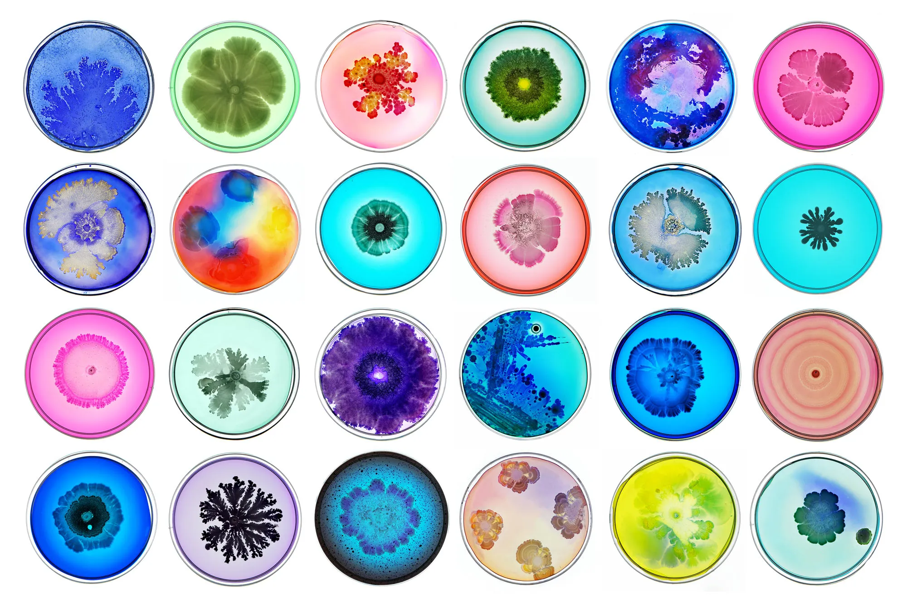
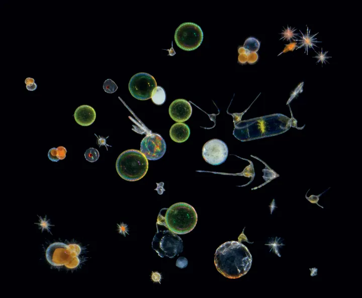

# Week 08

[← Back to Home](../index.md)

## Documentation 

  I am not surprised that people cannot tell what the data is, as that has been a problem in this project from the beginning. It does align with something I already knew I needed to address: being more specific about what the viewer is actually looking at without making the work literal or turning it into a chart. What the feedback did do was push my thinking in a new direction. I started thinking about things that are alive in the ocean that are naturally abstract looking which got me to microorganisms and bacteria. They are colourful, circular, have really interesting patterns and designs, and there is something about them that is abstract but still instantly recognisable as a biological thing. If the visual language of the work pulled from that world rather than from conventional ocean imagery like waves or fish, it might give viewers a way into the piece without me having to label everything. The thing I am happy about from the feedback is that everyone said it looked nice or interesting. That matters because one of the core goals of this project is making something that catches your attention and keeps it, something that stays in your mind, so you are more likely to come back to it and think about it. I want to follow up on the microorganism and bacteria idea and see if leaning into that visual language helps make the work more connectable for viewers.
 
 
 *Photo of Ocean Bacteria*
  
 
 *Photo of Ocean Microorganisms*

 
 <iframe src="https://editor.p5js.org/akim318/full/i8Uvv3FNa"></iframe>
 

## Images & Media

*Use the format below to embed images from your assets folder:*

``
`*Your caption here*`

*The text inside the square brackets is alt text (a description for accessibility), not a visible caption. To add a caption, place a line of italic text below the image.*

## AI Usage Statement

*Document any use of AI tools under an AI Usage Statement heading. Explain which tools you used and describe how you used them. Reference any AI-generated content (see [QuickCite](https://auckland.libguides.com/referencing-generative-ai-tools) for guidance).*
