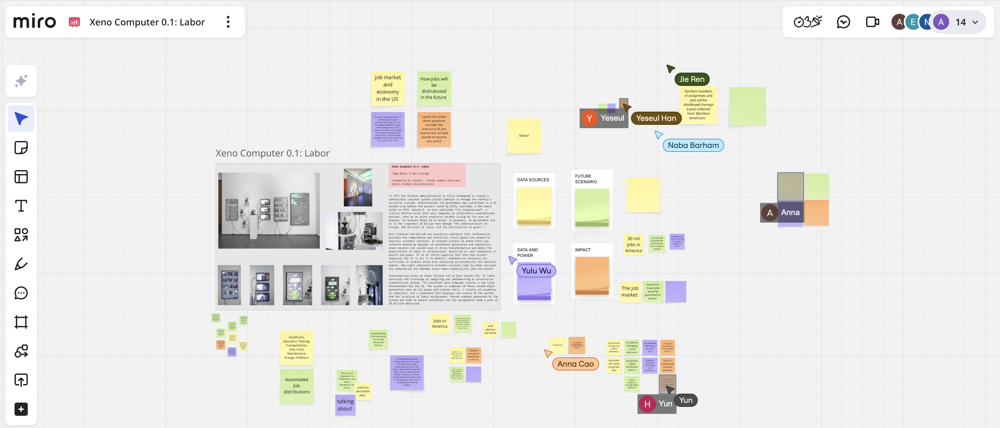
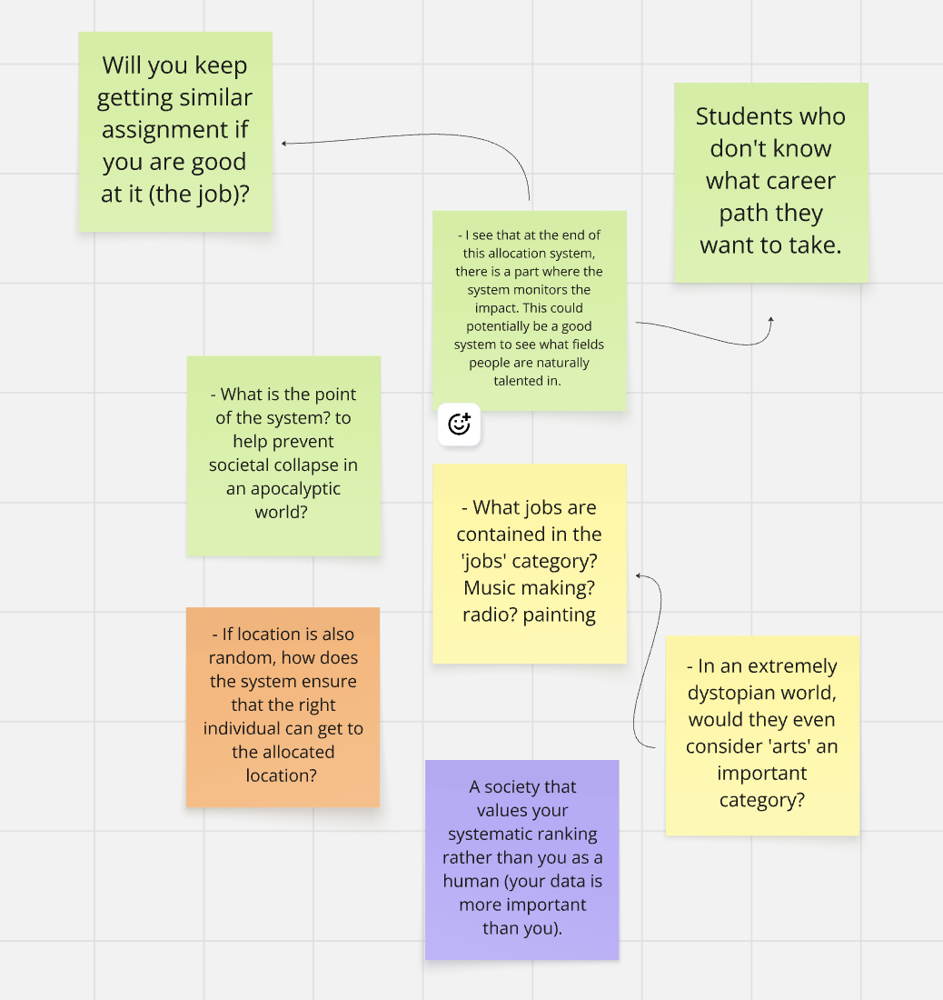
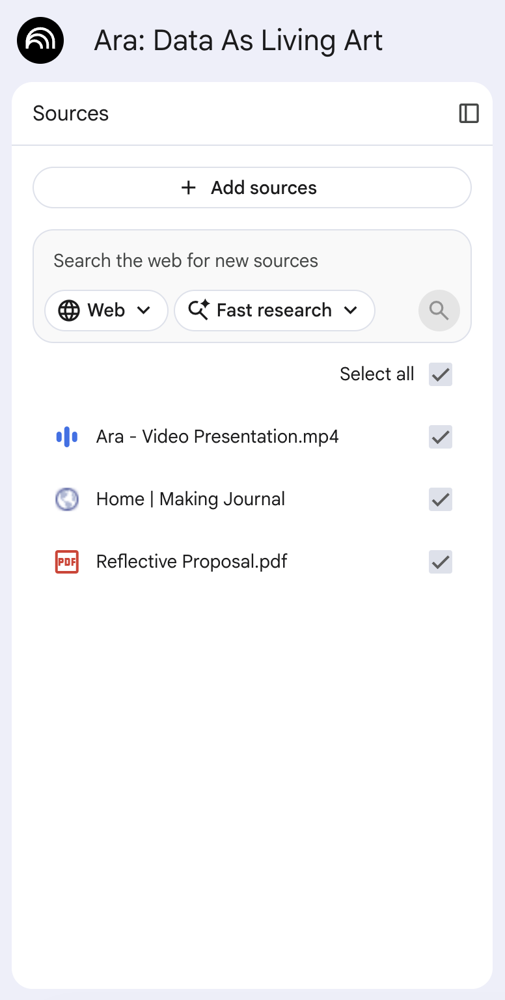

# Week 09

[← Back to Home](../index.md)

## Documentation 
# Introduction
 Hello and welcome to Week Nine of DES250: Designing with Data! This week was all about consolidating. After weeks of experimenting and building, it was time to commit to a direction in writing by drafting a project statement that pulls everything together and reveals what still needs to be resolved. We also did another making sprint and shared our work with peers through a round robin rapid reactions session.

## Project Statement: First Draft
### Case Study - Xeno Computer 0.1: Labor By Tega Brain And Sam Lavigne
 Before drafting our own statements we worked in pairs on a Miro board about the Xeno Computer 0.1: Labor case study. This was a useful warm up because it asked us to think critically about how a project statement works, what it needs to do and what it reveals about the work. The work draws on labour data; specifically the hidden computational and human labour behind AI systems. The system uses a pool of 30 million Americans as its dataset. The physical system itself is composed of three random digit generators made of air pumps and coloured balls, a cluster of Raspberry Pi computers, and a dashboard displaying the status of the system and the locations of labour assignments. The work picks up from two historical precedents: the Allende administration's Cybersyn project in 1971, which attempted to create a centralised computer system to manage Chile's socialist economy before being cut short by a US backed coup, and Ursula K. Le Guin's 1974 novel The Dispossessed, which imagines an alien society where computers manage the administration of things, the division of labour, and the distribution of goods. The project argues that data is never neutral, the decision to make certain labour visible and other labour invisible is always a political choice. The work uses data to expose what systems of power prefer to keep hidden. The intended impact is to make viewers uncomfortable with their own complicity in systems they benefit from but rarely examine. Working through these questions for someone else's project made it easier to think about what my own statement needed to do. A good project statement should not just describe the work but help make a solid argument for why the work exists and what it is trying to change.

 To help guide our thinking and discussion, we were given four different coloured sticky note prompts to respond to. Here are my thoughts on each one:

 
 *Screenshot of Case Study Xeno Computer on Miro Board*
 
 
 *Screenshot of my Notes for Case Study Xeno Computer on Miro Board*

### Data Sources:
 - In an extremely dystopian world, would they even consider 'arts' an important category?
 
 - What jobs are contained in the 'arts' category? Music making? Radio? Painting?

### Data And Power:
 - A society that values your systematic ranking rather than you as a human (your data is more important than you).

### Future Scenario:
 - I see that at the end of this allocation system, there is a part where the system monitors the impact. This could potentially be a good system to see what fields people are naturally talented in. 

 - Help students who don't know what career path they want to take.

 - Will you keep getting similar assignments if you are good at it (the job)?

 - What is the point of the system? To help prevent societal collapse in an apocalyptic world? 

### Impact:
 - If location is also random, how does the system ensure that the right individual can get to the allocated location? 

## Drafting With NotebookLM
 I created a new notebook in NotebookLM and added the following sources:
 - My Reflective Proposal
 - All journal entries (url link to my making journal)
 - My Week 8 video presentation
 - The template prompt from the class slides
 
 
 *Screenshot of my Sources in NotebookLM*

### Template Prompt:
 CONTEXT: I am a designer developing a data-driven visualisation for public display. The sources provided are from my project journal, documenting experiments, technical learning, conceptual development, and visual research.

 TASK: Using only information from these sources, draft a project statement for a general public audience.

 The statement must address each of the following:
 1. What the visualisation is
 2. The data source(s) used
 3. The subject matter and future scenario
 4. How the work engages critically with ideas about data representation
 5. The intended impact on a public audience

 FORMAT: Write in first person. Use clear, direct language appropriate for exhibition wall text. Aim for 300 words. Write in continuous prose without headers or bullet points.

 IMPORTANT: Draw only from information in the provided sources. If any of the five elements above are unclear or underdeveloped, note this briefly at the end rather than inventing details.

### First Draft
 I am creating a **living, moving artwork** that transforms real scientific data into a **slowly shifting, screen-based colour field visualisation**. This "living painting" is built using P5 JS and draws from two primary sources: **MoveBank**, which provides GPS tracking for whale sharks in the Gulf of Mexico, and **ISIS**, which supplies decades of oceanographic data, including sea surface temperature and plankton records from the northern Norwegian Sea. By layering these datasets from different regions into the same visual space, I aim to create a **portrait of the ocean as an interconnected living system** under pressure.

 The project is set within a **near-future scenario** where real-time ocean biotelemetry becomes a part of our **ambient public culture**, appearing in galleries, homes, and public spaces as something people live with daily. This work engages critically with the idea of data representation by moving away from traditional information design. I believe that **data, when stripped of bias, is the most honest version of life**, and it deserves to be seen that way rather than as a reductive chart. Therefore, I have intentionally removed all maps, labels, and legends—there is just the "ocean breathing". Instead, I use **abstract, watercolor-inspired radial gradients** where data points determine the position, size, and pulse of light on the canvas.

 The intended impact is to **bridge the gap between information and connection**. As seen with the blue whales off Sri Lanka, having scientific data for years is often not enough to change human behavior; people must **feel connected** to the subject to care. By presenting data as something beautiful to return to and sit with over time, I hope to foster an **emotional relationship** that eventually shifts how the public thinks and acts toward our marine environments.

 ***

 **Note on underdeveloped elements:** The specific technical details of how the ISIS temperature and plankton data will be visually mapped (color vs. flow) are less developed in the sources compared to the whale shark movement data, as the current prototype primarily focuses on the latter.

### Evaluation Of The Draft
### What Is Working Well In This Draft?:
 The draft succeeds in giving a coherent overview of the project; the data sources, visual method, future scenario, and intended impact are all present and accounted for. It doesn't miss anything major.

### What Is Missing Or Underdeveloped?:
 The draft lacks a critical lens, it describes what the project is doing but never really questions it or pushes back on itself. The other thing that's missing is me; my voice, my perspective and my particular reason for caring about this. The AI flattens everything into the same confident, detached tone, which is almost the opposite of what the project is arguing for. A piece of work about emotional connection shouldn't have a statement that feels emotionally absent.

 ### What Feels Overly Generalised Or ‘AI-Like’?:
 The most obvious giveaway is the adjective stacking. Phrases like "living, moving artwork" and "slowly shifting, screen based colour field visualisation" pile multiple descriptors onto a single thing, where each word ends up doing so little work that you need three of them to say anything at all. It's ironic given that the project is fundamentally about stripping things back, removing maps, labels, legends and yet the language describing it does the opposite.

### What Do You Need To Research Further?: 
 I need to look more closely at projects with similar aims; specifically how other designers and artists working with environmental or ecological data have chosen to display their work and connect with a public audience. Beyond precedents, I also want to build out a stronger visual reference bank to actively bounce ideas off rather than just describing what I want the work to look like.

## My One Sentence:
 This project aims to foster an emotional relationship between humans and otherwise impersonal but relevant and important environmental constructs, such as whale migration patterns and marine life observations, in order to shift how the public thinks and acts toward our marine environments.

## Peer Share
### What Is Clear And Compelling? & What Still Needs To Be Developed Or Resolved?:
 It covers what was previously mentioned during the wk8 crit pretty accurately meaning that your project was well described in the source (your journal) could also gather visual reference to bounce your ideas off.

## Making Sprint
### Rapid Prototyping
 Before jumping into the sprint we took ten minutes to plan. I looked back at the project statement draft and the feedback from the peer share and tried to identify what the project most needed right now. Based on where the project is sitting, the priority for this sprint was reworking the visual system to more deliberately reflect the microorganism idea I had been developing since last week, and making sure that every visual property in the sketch is actually tied to something in the data, not just the movement. Right now the prototype is only partially data driven as the position of each circle correlates to the real GPS location of a whale shark, and the drift loosely reflects movement, but the pulsing and the colour changes are not connected to anything in the data yet. My goals for this sprint are:
 - Rework the circle system so it reads more like ocean microorganisms, so more organic, more biological moving away from the watercolour painting style.
 - Map the pulse rate and/or colours of the circles to a specific data property.
 - Produce something testable that I can get feedback on.

## Round Robin Rapid Reactions
 For the last activity of the class we split into two groups; Presenters and Visitors. Presenters set up at a fixed station with their project statement and making sprint outcome ready to show, while Visitors circulated around the room spending time with each person before moving on. After 20 minutes we swapped roles. I worked as a Presenter first so I noted down the reactions and questions I got from visitors as they came through.

### Presenting
 
 *Photo of my Round Robin Presentation Setup*

 
 *Photo of my Round Robin Presentation Setup Note*
 
 I left my laptop open with my digital data portrait on one side of the screen and the first draft project statement on the otherside. I then left out sticky notes and a pen and wrote on a sticky note and stuck it to my laptop saying "please leave some notes!" in hopes that this would be a less confrontational way to get people to give me feedback and their questions on my project but actually this didnt work so i start talking with the people that was walking past or looking at my project and that was suprisingly more effective at getting people to talk to me about my project and tell me their thoughts, opinions and questions they had about my project.

 here are the feedback notes i took:
 - If it’s ocean why does it look like bacteria, it would be recognisable if the background was blue
 - Giving a voice to the inhuman 
 - Why are the shape overlapping when they are from the different parts of the ocean - what is there connection?
 - What parts of the data did u use? U have a lot listed 
 - What does each movement means? Growing bigger and smaller - overlapping the legs of the bacteria 
 - Texture to the blue - ocean waves in the sand when snorkeling 
 - I don’t know what it is so that’s what keeps my interest, I want to keep seeing to figure it out

 Within the feedback, a few things stood out. The bacteria comment came up more than once, people were independently making the same connection between the visual language and microorganisms, which confirmed that the direction I started exploring in Week 8 is already present in the work without me having forced it. The data is producing something that reads as biological and ocean like on its own. The comment about not knowing what it is being the thing that keeps someone's interest was the most encouraging piece of feedback I received. That is exactly the effect the work is designed to produce, something that pulls you in not because it explains itself but because it does not. The question is how to make sure that curiosity leads somewhere meaningful rather than just leaving people confused.

## Independent Study
 - updated data portrait
 - presentation for week 10