# Week 10

[← Back to Home](../index.md)

## Documentation 
# Introduction
 Hello and welcome to Week Ten of DES250: Designing with Data! this week we used Padlet as our feedback platform for a structured critique session where we presented our projects to our groups, giving and receiving feedback through rotating roles, and then going out to review what other groups were working on. 

## Progress Reports
 Our group; Madi, Alisa, Jay, and I presented our project again in a round robin slideshow format. Each person got 5 minutes to present, then the group discussed and gave feedback, with rotating roles; Chair, Technical Commenter, and Conceptual Commenter so everyone was actively engaged even when they weren't presenting. Feedback was posted to each presenter's card on our group Padlet board across four columns, and after all the live presentations we went back through the board to add anything that didn't come up in the discussion.

### My Presentation
 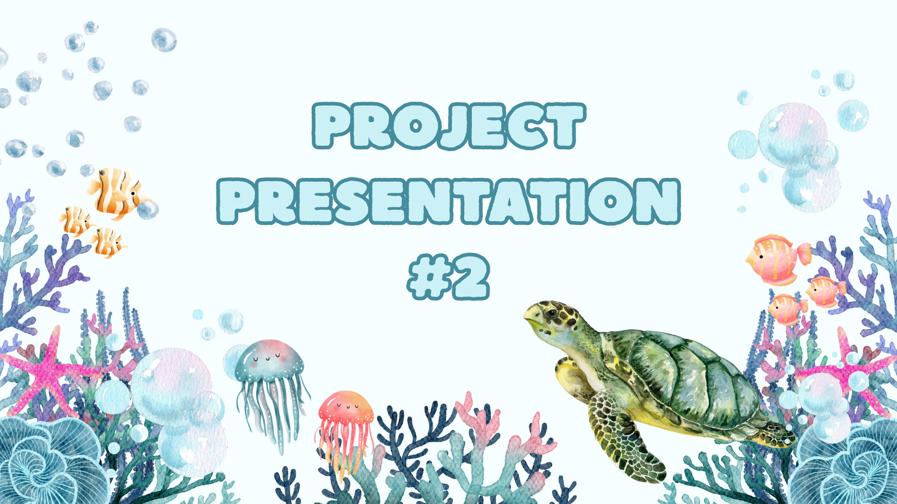
 *Screenshot of my Presentation Slide One*

 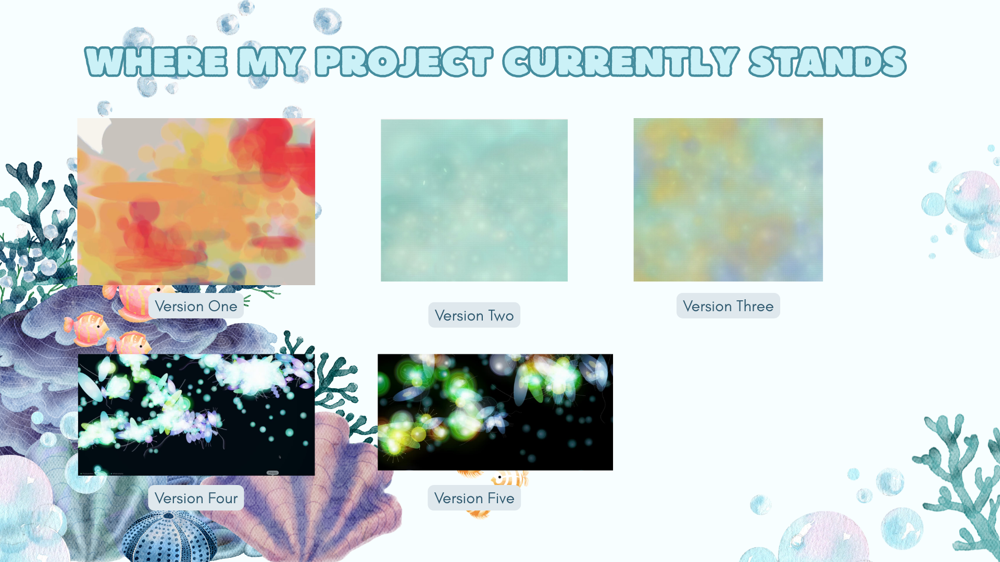
 *Screenshot of my Presentation Slide Two*

 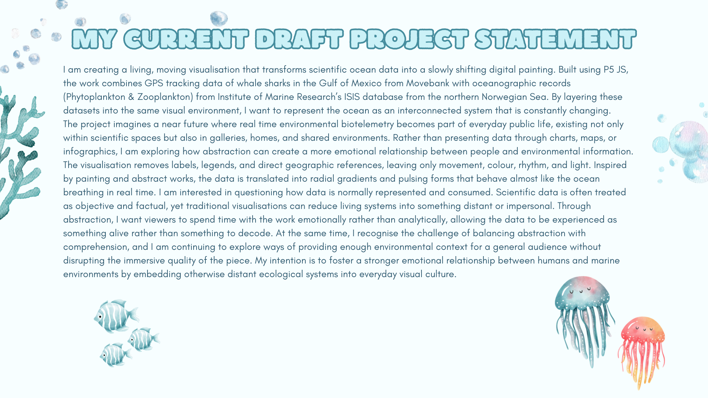
 *Screenshot of my Presentation Slide Three*

 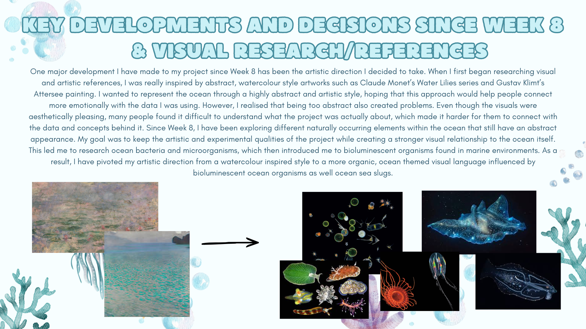
 *Screenshot of my Presentation Slide Four*

 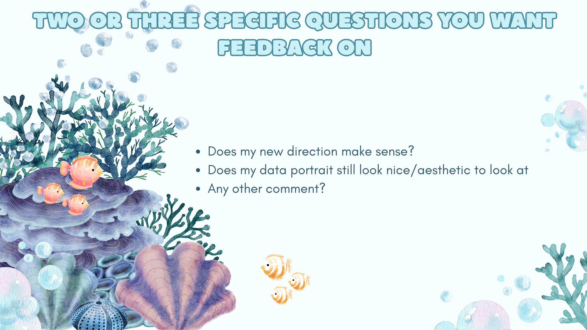
 *Screenshot of my Presentation Slide Five*

 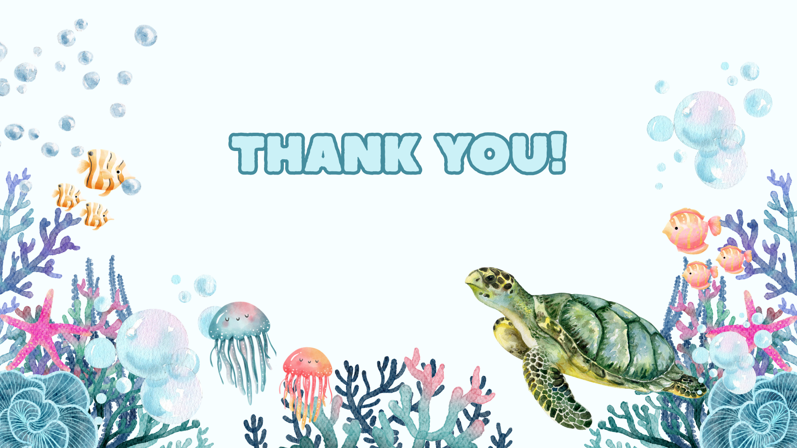
 *Screenshot of my Presentation Slide Six*

### Feedback/Comments Received While Presenting
 - The new theme connects with the project more but not as cutesy.
 - Cool idea.
 - Still cool to look at but the other one looks nicer.
 - Still not as recognisable but with context it makes a lot of sense.
 
 This actually connects really well to the feedback from last session's round robin, where someone said it's pretty and abstract and they didn't know what they were looking at but that's exactly what made them want to keep looking. If you get it straight away, why would you keep staring at it? The not knowing is the whole point, it's what pulls you in. So hearing similar things again this session made me feel like I've hit the sweet spot I was looking for. It's abstract enough to make you curious, but it's not so out there that context can't bring it together. The push and pull between the old and new theme is interesting too, the old one looked more polished, but the new one actually means something. It's making me think about whether I should be chasing aesthetics or letting the concept drive everything first and making it look good second. Next I want to make the current direction look as good as it can without losing what makes it work conceptually, basically make it prettier without watering it down.

### Padlet
 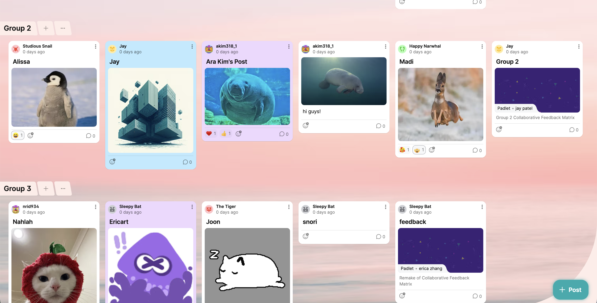
 *Screenshot of the Class Padlet*

 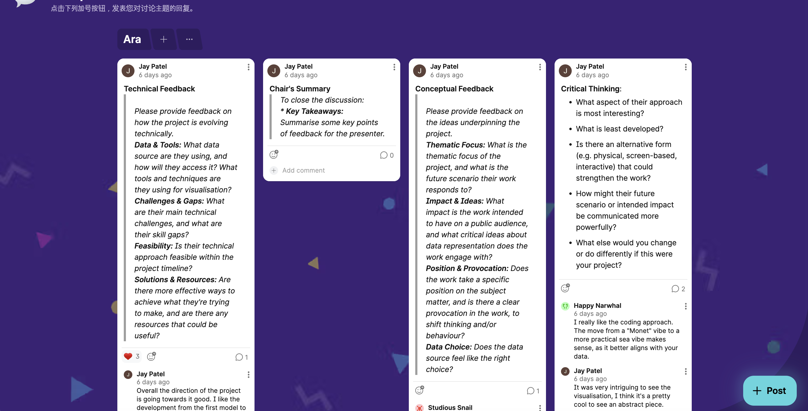
 *Screenshot of the Padlet Feedback Prompts*

 The feedback pillars we had were:  
 1. Technical Feedback: Please provide feedback on how the project is evolving technically. Data & Tools: What data source are they using, and how will they access it? What tools and techniques are they using for visualisation? Challenges & Gaps: What are their main technical challenges, and what are their skill gaps? Feasibility: Is their technical approach feasible within the project timeline? Solutions & Resources: Are there more effective ways to achieve what they're trying to make, and are there any resources that could be useful?

 2. Chair's Summary: To close the discussion: Key Takeaways: Summarise some key points of feedback for the presenter.

 3. Conceptual Feedback: Please provide feedback on the ideas underpinning the project. Thematic Focus: What is the thematic focus of the project, and what is the future scenario their work responds to? Impact & Ideas: What impact is the work intended to have on a public audience, and what critical ideas about data representation does the work engage with? Position & Provocation: Does the work take a specific position on the subject matter, and is there a clear provocation in the work, to shift thinking and/or behaviour? Data Choice: Does the data source feel like the right choice?

 4. Critical Thinking: What aspect of their approach is most interesting? What is least developed? Is there an alternative form (e.g. physical, screen-based, interactive) that could strengthen the work? How might their future scenario or intended impact be communicated more powerfully? What else would you change or do differently if this were your project?

### Feedback I Recieved On Padlet
 
 *Screenshot of Feedback I Recieved on Padlet for Technical Feedback*

 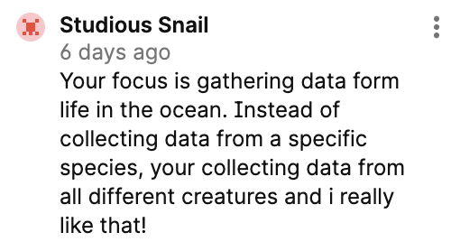
 *Screenshot of Feedback I Recieved on Padlet for Conceptual Feedback*

 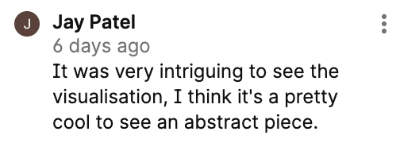
 *Screenshot of Feedback I Recieved on Padlet for Critical Thinking*

 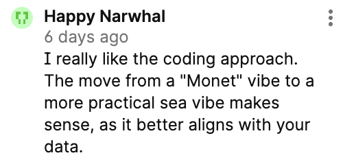
 *Screenshot of Feedback I Recieved on Padlet for Critical Thinking*

### Feedback I Gave On Padlet
 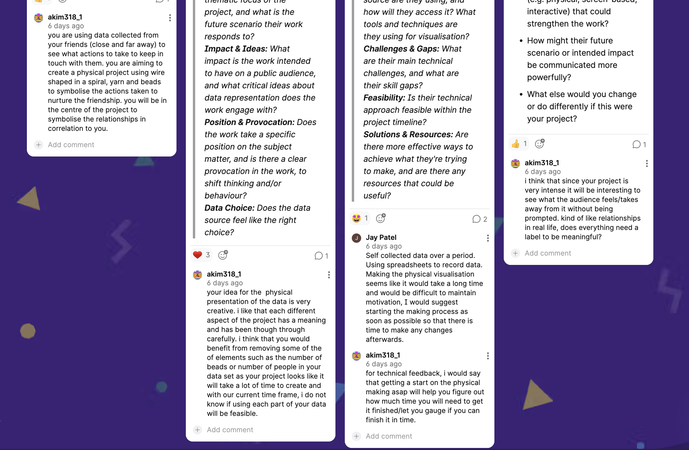
 *Screenshot of Feedback I Gave on Padlet for Madi*
 
 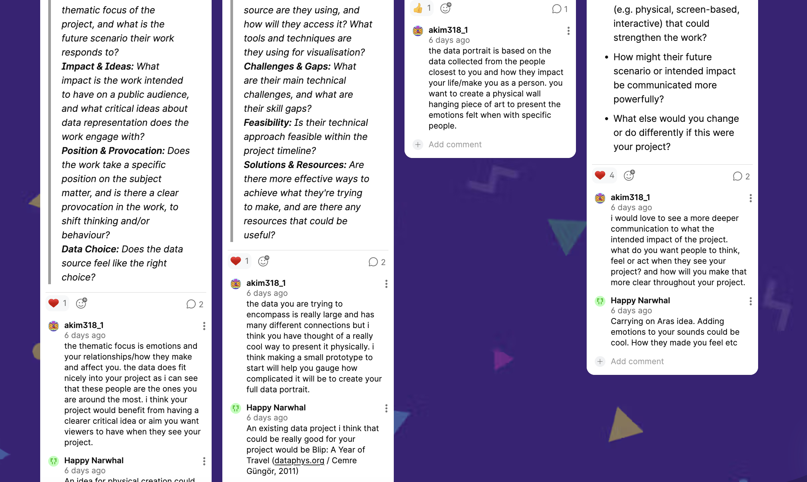
 *Screenshot of Feedback I Gave on Padlet for Alisa*
 
 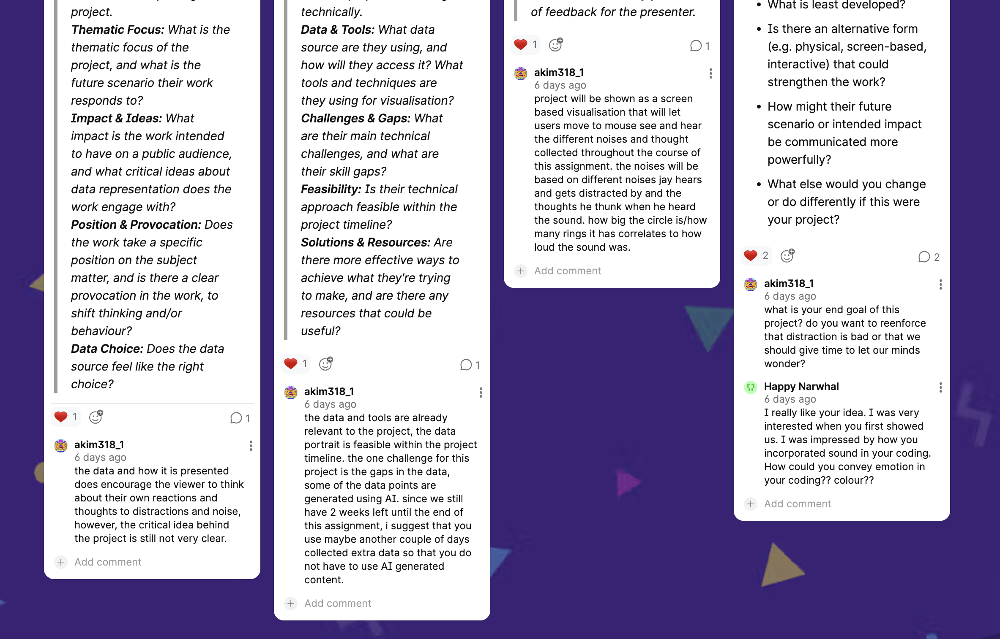
 *Screenshot of Feedback I Gave on Padlet for Jay*

### Gallery Walk
 After our own presentations wrapped up, I went through the other groups' Padlet boards via the main class board. I visited Groups 2 and 3, but both boards already had a lot of really solid feedback covering the technical and conceptual angles well, there wasn't much left to add that hadn't already been said. So rather than repeating what was already there, I used the heart button to upvote the feedback I thought was most useful and on point.

### Action Plan
 The most significant thing I'm taking away from this critique session is that the balance I've landed on; abstract enough to create curiosity, grounded enough to make sense with context is working, and I should trust it rather than second guessing it. The feedback that the new theme fits the concept better but has lost some visual polish tells me exactly where to focus next: the concept is solid, the execution needs work.
 My concrete action points going forward are:
 1. Refine the visual quality of the current direction: spend time on the details that make it feel considered and finished.
 2. Keep the level of abstraction where it is: don't over explain it visually or strip back the ambiguity trying to make it more 'readable'.
 3. Let the concept lead aesthetic decisions: if something looks nice but doesn't serve the idea, cut it.

## Independent Study
### Project Development

 <iframe src="https://editor.p5js.org/akim318/full/YVImpay2r" height="500" width="600"></iframe>
